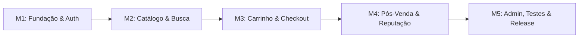

# 📌 Backlog Completo e Roteiro de Execução — TheMerchant

> **Planejamento Cronológico de Sprints, Milestones e Distribuição de Tarefas**  
> **Repositório:** [IgorMarcoli/TheMerchant](https://github.com/IgorMarcoli/TheMerchant)  
> **Contribuidores:**  
> - **João Pedro Martins de Andrade** ([@JoaoPMA23](https://github.com/JoaoPMA23))  
> - **Igor Marcoli Bastos** ([@IgorMarcoli](https://github.com/IgorMarcoli))  

---

## 🗺️ Visão Geral do Projeto de Ponta a Ponta

O desenvolvimento do **TheMerchant** foi organizado em **5 Milestones (Fases Cronológicas)** com um total de **25 Issues**, guiando a dupla desde o alinhamento da infraestrutura inicial até os testes ponta a ponta e a homologação final:

### Resumo das Milestones

| Milestone | Etapa | Descrição e Foco | Requisitos |
| :---: | :--- | :--- | :--- |
| **M1** | **Fundação, Autenticação e Perfis** | Setup base do Laravel, banco, design system com Tailwind/Blade e controle de papéis (RBAC). | RF01, RF02, RF03, RF04, RNF01, RNF02, RNF03, RNF08 |
| **M2** | **Catálogo, Anúncios e Mecanismo de Busca** | CRUD de jogos/categorias, cadastro de anúncios com galeria de fotos, vitrine Home e motor de busca com filtros. | RF05, RF06, RF07, RF08, RNF01, RNF05 |
| **M3** | **Carrinho, Checkout Transacional e Pagamentos** | Persistência do carrinho, UI dinâmica de itens, serviço atômico de checkout e gateway de pagamentos com webhooks. | RF09, RF10, RF11, RNF04, RNF06, RNF09 |
| **M4** | **Pós-Venda, Entrega Digital e Reputação** | Painéis de pedidos e vendas, confirmação de entrega do item e motor dinâmico de avaliação com estrelas. | RF12, RF13, RF14, RNF01, RNF07 |
| **M5** | **Painel Administrativo, Moderação e Qualidade** | Dashboard de KPIs, moderação de denúncias, testes automatizados e homologação final para apresentação. | RF15, RNF02, RNF03, RNF06, RNF08 |

---

## 👥 Resumo da Distribuição das 25 Tarefas

| Tipo de Atribuição | Quantidade | Descrição do Escopo |
| :--- | :---: | :--- |
| **Tarefas em Dupla (Pair Programming)** | **4 Issues** | Setup e migrations iniciais (#01), Homologação sandbox do gateway (#16), Teste E2E de compra/entrega (#21), Revisão final e apresentação (#25) |
| **João Pedro ([@JoaoPMA23](https://github.com/JoaoPMA23))** | **10 Issues (+4)** | **Front-end:** Design System base e Blade Components (#04), Interface interativa de filtros do catálogo (#08), Interface reativa do carrinho (#12), Componente interativo de estrelas com Alpine.js (#20). **Back-end & Arquitetura:** Modelagem & Auth RBAC (#02), Motor de busca com índices compostos (#07), Camada de Checkout Transacional (#13), Gateway de Pagamentos e Webhooks (#14), Motor atômico de reputação (#19), Testes automatizados com Pest/PHPUnit (#24). |
| **Igor Marcoli ([@IgorMarcoli](https://github.com/IgorMarcoli))** | **11 Issues (+4)** | **Front-end & Telas:** Telas de Login e Cadastro (#03), Vitrine da Home com Destaques (#09), Página detalhada do anúncio (#10), Interface de Checkout e Termos (#15), Painel de Pedidos do Comprador (#17), Painel de Vendas (#18), Dashboard Administrativo (#22), Fila de Denúncias (#23). **Back-end & Entidades:** Catálogo de Jogos e Categorias (#05), CRUD de Anúncios com Upload de Fotos (#06), Estrutura e persistência do Carrinho (#11). |

---

# 🚀 Roteiro Passo a Passo das 25 Issues

---

## 🎯 Milestone 1: Fundação, Autenticação e Perfis *(Status: CONCLUÍDA ✅)*

### Issue #01: `[Setup/Geral] Alinhamento Inicial do Repositório, Migrations Base e Padrão de Branches`
- **Status:** `CONCLUÍDA / CLOSED ✅`
- **Assignees:** `@JoaoPMA23`, `@IgorMarcoli` *(Trabalho em Dupla)*
- **Milestone:** `M1: Fundação, Autenticação e Perfis`
- **Labels:** `backend`, `database`, `architecture`
- **Requisitos:** `RNF08`
- **Resumo:** Sincronização do ambiente de desenvolvimento, estruturação executável do Laravel (`artisan`, `public/index.php`, `.htaccess`, `.env`), migrations de todas as entidades do banco (com integridade referencial), documentação com link oficial do repositório no `README.md` e alinhamento do Git Flow conforme o `CONTRIBUTING.md`.

---

### Issue #02: `[Backend/Auth] Modelagem de Usuários, Autenticação Segura e Controle de Perfis (RBAC)`
- **Status:** `CONCLUÍDA / CLOSED ✅`
- **Assignee:** `@JoaoPMA23`
- **Milestone:** `M1: Fundação, Autenticação e Perfis`
- **Labels:** `backend`, `security`, `database`
- **Requisitos:** `RF01`, `RF02`, `RF03`, `RF04`, `RNF02`, `RNF03`
- **Resumo:** Implementação da autenticação baseada em sessão segura, hashing irreversível de senhas (Bcrypt), Models `User` e `SellerProfile`, rotinas de login/registro/logout no `AuthController`, e rotinas de controle de acesso de **Página de Perfil** e **Troca de Senha** segura com checagem de senha atual em `ProfileController`.

---

### Issue #03: `[UI/Auth] Telas de Login, Cadastro com Seleção de Perfil e Feedback de Validação`
- **Status:** `CONCLUÍDA / CLOSED ✅`
- **Assignee:** `@IgorMarcoli`
- **Milestone:** `M1: Fundação, Autenticação e Perfis`
- **Labels:** `frontend`, `ui/ux`, `blade`
- **Requisitos:** `RF01`, `RF02`, `RNF01`
- **Resumo:** Construção das views de autenticação (`login.blade.php` e `register.blade.php`) com Tailwind CSS e validação visual, além da interface completa de **Página de Perfil e Troca de Senha** (`profile/edit.blade.php`) com cards de informações pessoais, biografia e alteração de credenciais.

---

### Issue #04: `[UI/Components] Design System Base, Layout Mestre e Biblioteca de Componentes Blade`
- **Status:** `CONCLUÍDA / CLOSED ✅`
- **Assignee:** `@JoaoPMA23`
- **Milestone:** `M1: Fundação, Autenticação e Perfis`
- **Labels:** `frontend`, `ui/ux`, `blade`
- **Requisitos:** `RNF01`
- **Resumo:** Estruturação do layout mestre `layouts/app.blade.php`, barra de navegação responsiva com menu condicional (visitante vs autenticado, atalhos de perfil e logout) e biblioteca de componentes reutilizáveis (`<x-badge>`, `<x-listing-card>`, alertas flash dismissible).

---

## 🎯 Milestone 2: Catálogo, Anúncios e Mecanismo de Busca

### Issue #05: `[Backend/Catalog] Catálogo de Jogos, Categorias e Estruturação das Entidades de Anúncio`
- **Assignee:** `@IgorMarcoli`
- **Milestone:** `M2: Catálogo, Anúncios e Mecanismo de Busca`
- **Labels:** `backend`, `database`
- **Requisitos:** `RF06`, `RNF08`
- **Resumo:** Migrations e Models de `games`, `categories`, `listings` e `listing_images` com relacionamentos Eloquent tipados e seeders de dados iniciais para testes.

---

### Issue #06: `[Feature/Listings] Painel do Vendedor: CRUD de Anúncios com Galeria de Múltiplas Imagens`
- **Assignee:** `@IgorMarcoli`
- **Milestone:** `M2: Catálogo, Anúncios e Mecanismo de Busca`
- **Labels:** `backend`, `frontend`, `feature`
- **Requisitos:** `RF05`, `RF06`, `RNF03`
- **Resumo:** Área de gestão de anúncios do vendedor, com suporte a upload de até 6 fotos no Storage, validação em `ListingStoreRequest`, botão de pausar/ativar e proteção de edição via `ListingPolicy`.

---

### Issue #07: `[Backend/Search] Motor de Busca Dinâmico, Filtros Combinados e Otimização com Índices`
- **Assignee:** `@JoaoPMA23`
- **Milestone:** `M2: Catálogo, Anúncios e Mecanismo de Busca`
- **Labels:** `backend`, `database`, `performance`
- **Requisitos:** `RF07`, `RNF05`
- **Resumo:** Query builder dinâmico no `ListingPublicController` com suporte a filtros cumulativos (busca textual, jogo, categoria, preço min/max, ordenação), preservação de query parameters e índices de banco para respostas em < 500ms.

---

### Issue #08: `[UI/Search] Interface Interativa de Filtros do Catálogo com Sliders e Tags Dinâmicas`
- **Assignee:** `@JoaoPMA23`
- **Milestone:** `M2: Catálogo, Anúncios e Mecanismo de Busca`
- **Labels:** `frontend`, `ui/ux`, `blade`
- **Requisitos:** `RF07`, `RNF01`
- **Resumo:** Interface do catálogo com formulário responsivo de filtros, tags ativas de pesquisa com remoção rápida, feedback de carregamento em Alpine.js e estilização refinada da paginação do Laravel.

---

### Issue #09: `[UI/Catalog] Vitrine da Página Inicial com Destaques e Categorias Populares`
- **Assignee:** `@IgorMarcoli`
- **Milestone:** `M2: Catálogo, Anúncios e Mecanismo de Busca`
- **Labels:** `frontend`, `ui/ux`, `blade`
- **Requisitos:** `RF08`, `RNF01`
- **Resumo:** Construção da Home (`home.blade.php`) com banner principal (Hero Section), atalhos clicáveis para jogos em destaque com contadores e grid de lançamentos de cosméticos/serviços.

---

### Issue #10: `[UI/Product] Página Detalhada do Anúncio com Carrossel de Fotos e Dados Comerciais`
- **Assignee:** `@IgorMarcoli`
- **Milestone:** `M2: Catálogo, Anúncios e Mecanismo de Busca`
- **Labels:** `frontend`, `ui/ux`, `blade`
- **Requisitos:** `RF08`, `RNF01`
- **Resumo:** Layout em 2 colunas para detalhes do produto (`listings/show.blade.php`), carrossel de fotos, especificações, card do vendedor com reputação e modal para denúncia rápida de anúncios suspeitos.

---

## 🎯 Milestone 3: Carrinho, Checkout Transacional e Pagamentos

### Issue #11: `[Feature/Cart] Estrutura do Carrinho de Compras, Persistência e Regras de Adição`
- **Assignee:** `@IgorMarcoli`
- **Milestone:** `M3: Carrinho, Checkout Transacional e Pagamentos`
- **Labels:** `backend`, `feature`
- **Requisitos:** `RF09`
- **Resumo:** Migrations de `carts` e `cart_items`, métodos de adição/remoção/limpeza no `CartController` e regras de negócio para impedir compra de anúncios próprios ou itens já indisponíveis.

---

### Issue #12: `[UI/Cart] Interface do Carrinho com Atualização Dinâmica, Subtotais e Alertas`
- **Assignee:** `@JoaoPMA23`
- **Milestone:** `M3: Carrinho, Checkout Transacional e Pagamentos`
- **Labels:** `frontend`, `ui/ux`, `blade`
- **Requisitos:** `RF09`, `RNF01`
- **Resumo:** Tela de carrinho (`cart/index.blade.php`) em 2 colunas com lista de itens, capa do produto, dados do vendedor, cálculo de subtotal geral, estado vazio acolhedor e modal de confirmação para esvaziar carrinho.

---

### Issue #13: `[Backend/Checkout] Camada de Serviço de Checkout Transacional com Congelamento de Preços`
- **Assignee:** `@JoaoPMA23`
- **Milestone:** `M3: Carrinho, Checkout Transacional e Pagamentos`
- **Labels:** `backend`, `architecture`, `database`
- **Requisitos:** `RF10`, `RNF06`
- **Resumo:** Serviço de domínio `CheckoutService` com `DB::transaction()`, validação concorrente de disponibilidade, geração de pedido único (`ORD-XXXX-YYYYMMDD`), congelamento do preço histórico em `order_items` e rollback atômico em caso de falhas.

---

### Issue #14: `[Backend/Payments] Integração com Gateway de Pagamento, Webhook Assíncrono e Idempotência`
- **Assignee:** `@JoaoPMA23`
- **Milestone:** `M3: Carrinho, Checkout Transacional e Pagamentos`
- **Labels:** `backend`, `payment`, `security`
- **Requisitos:** `RF11`, `RNF04`, `RNF06`, `RNF09`
- **Resumo:** Camada desacoplada `PaymentGatewayService`, endpoint seguro de Webhook com verificação de assinatura HMAC, job assíncrono em fila e trava de idempotência para garantir que nenhum pagamento seja creditado ou confirmado duplamente.

---

### Issue #15: `[UI/Checkout] Interface de Checkout, Instruções de Entrega e Telas de Status de Compra`
- **Assignee:** `@IgorMarcoli`
- **Milestone:** `M3: Carrinho, Checkout Transacional e Pagamentos`
- **Labels:** `frontend`, `ui/ux`, `blade`
- **Requisitos:** `RF10`, `RNF01`
- **Resumo:** Tela de checkout com campo opcional para Trade URL / horários de coaching, validação em `CheckoutRequest` com aceite obrigatório das diretrizes dos jogos e telas de sucesso (`checkout/success.blade.php`) e cancelamento.

---

### Issue #16: `[Integração/Geral] Testes Conjuntos do Fluxo de Pagamento em Sandbox e Simulação de Webhooks`
- **Assignees:** `@JoaoPMA23`, `@IgorMarcoli` *(Trabalho em Dupla)*
- **Milestone:** `M3: Carrinho, Checkout Transacional e Pagamentos`
- **Labels:** `backend`, `payment`, `testing`
- **Requisitos:** `RF10`, `RF11`, `RNF06`
- **Resumo:** Homologação conjunta em ambiente sandbox da jornada completa de pagamento: emissão de preferência, simulação de retorno do gateway, conferência da mudança para status `pago` e validação do retry idempotente do webhook.

---

## 🎯 Milestone 4: Pós-Venda, Entrega Digital e Reputação

### Issue #17: `[Feature/Orders] Painel de Acompanhamento de Pedidos e Histórico Cronológico do Comprador`
- **Assignee:** `@IgorMarcoli`
- **Milestone:** `M4: Pós-Venda, Entrega Digital e Reputação`
- **Labels:** `frontend`, `backend`, `feature`
- **Requisitos:** `RF12`, `RNF03`
- **Resumo:** Histórico de compras do usuário autenticado com paginação, badges de status do pedido e visualização detalhada com timeline de entrega (`orders/index.blade.php` e `orders/show.blade.php`).

---

### Issue #18: `[Feature/Sales] Painel de Vendas Recebidas do Vendedor e Ação de Entrega Digital`
- **Assignee:** `@IgorMarcoli`
- **Milestone:** `M4: Pós-Venda, Entrega Digital e Reputação`
- **Labels:** `backend`, `frontend`, `feature`
- **Requisitos:** `RF13`
- **Resumo:** Painel de vendas para acompanhamento dos pedidos recebidos pelo vendedor (`seller/sales/index.blade.php`), com botão de marcar como entregue e transição automática do pedido para `concluido`.

---

### Issue #19: `[Backend/Reviews] Motor de Avaliação Pós-Compra e Cálculo Dinâmico de Reputação`
- **Assignee:** `@JoaoPMA23`
- **Milestone:** `M4: Pós-Venda, Entrega Digital e Reputação`
- **Labels:** `backend`, `database`, `business-rules`
- **Requisitos:** `RF14`, `RNF07`
- **Resumo:** Lógica de negócio no `ReviewController` com trava contra avaliações em pedidos não entregues, garantia de unicidade (1 avaliação por item) e recálculo transacional da média de estrelas e total de vendas em `seller_profiles`.

---

### Issue #20: `[UI/Reviews] Componente Interativo de Avaliação com Estrelas e Feedback Visual em Alpine.js`
- **Assignee:** `@JoaoPMA23`
- **Milestone:** `M4: Pós-Venda, Entrega Digital e Reputação`
- **Labels:** `frontend`, `ui/ux`, `blade`
- **Requisitos:** `RF14`, `RNF01`
- **Resumo:** Componente interativo com Alpine.js embutido na página do pedido para seleção de 1 a 5 estrelas com efeito de preenchimento visual no hover, campo de comentário e exibição da avaliação já enviada.

---

### Issue #21: `[E2E/Fluxo] Validação Ponta a Ponta da Compra, Entrega Digital e Concessão de Reputação`
- **Assignees:** `@JoaoPMA23`, `@IgorMarcoli` *(Trabalho em Dupla)*
- **Milestone:** `M4: Pós-Venda, Entrega Digital e Reputação`
- **Labels:** `testing`, `feature`
- **Requisitos:** `RF12`, `RF13`, `RF14`
- **Resumo:** Simulação ponta a ponta com duas contas: Igor como Vendedor anunciando um cosmético, João como Comprador realizando o checkout, envio simulado de pagamento, marcação de entrega e submissão da avaliação com atualização da reputação pública.

---

## 🎯 Milestone 5: Painel Administrativo, Moderação e Qualidade

### Issue #22: `[Feature/Admin] Painel Administrativo de Métricas Gerais e Gestão de Usuários e Categorias`
- **Assignee:** `@IgorMarcoli`
- **Milestone:** `M5: Painel Administrativo, Moderação e Qualidade`
- **Labels:** `admin`, `backend`, `frontend`
- **Requisitos:** `RF15`, `RNF03`
- **Resumo:** Dashboard administrativo (`admin/dashboard.blade.php`) com indicadores de faturamento, volume de transações e usuários, além de interfaces para cadastro de categorias e suspensão de contas irregulares.

---

### Issue #23: `[Feature/Moderation] Fila de Moderação de Denúncias e Bloqueio de Anúncios Suspeitos`
- **Assignee:** `@IgorMarcoli`
- **Milestone:** `M5: Painel Administrativo, Moderação e Qualidade`
- **Labels:** `admin`, `moderation`, `feature`
- **Requisitos:** `RF15`, `RNF09`
- **Resumo:** Fila de denúncias para moderadores (`admin/reports/index.blade.php`), com campo para inserção de parecer, opção de suspensão de anúncio e registro de log de auditoria.

---

### Issue #24: `[Backend/Security] Testes Automatizados de Regras Críticas, Políticas e Revisão de Segurança`
- **Assignee:** `@JoaoPMA23`
- **Milestone:** `M5: Painel Administrativo, Moderação e Qualidade`
- **Labels:** `testing`, `security`, `qa`
- **Requisitos:** `RNF02`, `RNF03`, `RNF06`, `RNF08`
- **Resumo:** Construção da suíte de testes com Pest/PHPUnit cobrindo checkout transacional, idempotência de webhooks, autorização de policies, sanitização contra XSS/CSRF e execução do formatador de código Laravel Pint (PSR-12).

---

### Issue #25: `[Release/Geral] Revisão Final de Usabilidade, Seeder de Demonstração e Preparação para Apresentação`
- **Assignees:** `@JoaoPMA23`, `@IgorMarcoli` *(Trabalho em Dupla)*
- **Milestone:** `M5: Painel Administrativo, Moderação e Qualidade`
- **Labels:** `qa`, `ui/ux`, `feature`
- **Requisitos:** `RNF01`, `RNF08`
- **Resumo:** Homologação geral do projeto com dados realistas (`DatabaseSeeder`), verificação da documentação e preparação do roteiro de apresentação demonstrando todos os fluxos exigidos na disciplina LES III.
