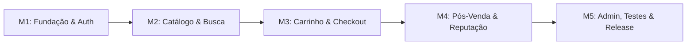

# Backlog e rastreabilidade — TheMerchant

Revisão de 18/09/2026, sincronizada com [GitHub](https://github.com/IgorMarcoli/TheMerchant/issues): **32 issues, 28 abertas e 4 fechadas**, distribuídas em cinco milestones. A numeração possui lacunas porque pull requests compartilham a sequência do GitHub.

O PDF original é a baseline de RF01–RF20. O responsável incluiu chat privado de texto em tempo real na v1 (RF21–RF23). Este documento descreve planejamento e estado das issues, não certificação de funcionalidades executadas.

## Milestones

| Milestone | Abertas / total | Escopo |
| :--- | :--- | :--- |
| [M1: Fundação, Autenticação e Perfis](https://github.com/IgorMarcoli/TheMerchant/milestone/10) | 2/6 | RF01–RF04; RNF01–RNF03, RNF07–RNF09. Base Laravel, sessão, RBAC, layout, verificação de e-mail e recuperação de acesso. #1–#4 permanecem fechadas; conclusão integral depende de #27 e da correção prioritária #28. Fechar apenas após evidências dessas entregas. |
| [M2: Catálogo, Anúncios e Mecanismo de Busca](https://github.com/IgorMarcoli/TheMerchant/milestone/11) | 7/7 | RF05–RF08 e RF16 (registro de denúncia). #5–#10 e #29: cosméticos/serviços elegíveis, capacidade/sessões, CRUD, galeria, busca por jogo/categoria/preço/reputação e detalhes. Chat da página de anúncio integrado na M4. Aceite: regras de disponibilidade e conclusão documentadas, filtros testados e denúncia persistida. |
| [M3: Carrinho, Checkout Transacional e Pagamentos](https://github.com/IgorMarcoli/TheMerchant/milestone/12) | 6/6 | RF09–RF12; RNF03–RNF06, RNF09. #11–#16: quantidades, reserva com expiração, pedido pendente, preço histórico, gateway sandbox, confirmação assíncrona e idempotência. Venda confirmada somente após aprovação; falha/cancelamento/expiração liberam reserva. Depende de #29; validar concorrência e pagamento tardio. |
| [M4: Pós-Venda, Entrega Digital, Reputação e Chat](https://github.com/IgorMarcoli/TheMerchant/milestone/13) | 8/8 | RF13–RF15 e RF21–RF23; RNF01, RNF03, RNF06–RNF09. #17–#21 e #30, #31, #32: pedidos/vendas, conclusão por item, avaliação única, chat privado em tempo real com vendedor antes/depois da compra, histórico e não lidas. Blade/Alpine + Reverb/Echo; aceite com duas sessões, isolamento e reconexão. |
| [M5: Painel Administrativo, Moderação e Qualidade](https://github.com/IgorMarcoli/TheMerchant/milestone/14) | 5/5 | RF16–RF20 e validação transversal RF01–RF23; RNF01–RNF09. #22–#25 e #33: usuários, jogos/categorias, denúncias, bloqueio/restauração, auditoria, revisão do PDF/UML e demonstração completa. Release depende de RF03, correção de diagnósticos, pagamento/estoque, E2E e chat com infraestrutura real. Testes são incrementais em todas as milestones. |

## Ordem e critérios de conclusão

1. Priorizar #28 (diagnósticos), concluir #27 (RF03) e validar M1. #1–#4 permanecem fechadas; M1 permanece aberta.
2. M2 inclui definição de cosméticos/coaching (#29), filtro por reputação e denúncia persistida.
3. M3 depende de #29: reserva → pagamento confirmado → consumo de disponibilidade; tratar falha, expiração e pagamento tardio.
4. M4 inclui chat (#30 → #31 → #32), pedidos/vendas, entrega e reputação; integrar contato pré-compra na página do anúncio.
5. M5 consolida moderação, restauração, segurança e documentação. #25 depende de #24, #27, #28, #32 e #33; testes são incrementais.
6. Datas não foram inventadas. Responsáveis existentes foram preservados; novas tarefas aguardam distribuição pela equipe.
7. A figura/PDF acadêmico ainda precisa da revisão acompanhada na #33; documentação textual não equivale à reexportação do PDF.

## Issues

### [#1 — [Setup/Geral] Alinhamento Inicial do Repositório, Migrations Base e Padrão de Branches](https://github.com/IgorMarcoli/TheMerchant/issues/1)

- Estado: fechada
- Milestone: M1: Fundação, Autenticação e Perfis
- Responsáveis: @IgorMarcoli, @JoaoPMA23

#### 📋 Contexto
Configuração da base do projeto em Laravel 11/12, sincronização das migrations essenciais do banco de dados (PostgreSQL/MySQL), estrutura inicial de pastas e alinhamento do fluxo de Git (branches `feat/`, `fix/` e Conventional Commits).

**Requisitos Vinculados:** `RNF08`

---

<<<<<<< Updated upstream
## 🗺️ Visão Geral do Projeto de Ponta a Ponta

O desenvolvimento do **TheMerchant** foi organizado em **5 Milestones (Fases Cronológicas)** com um total de **25 Issues**, guiando a dupla desde o alinhamento da infraestrutura inicial até os testes ponta a ponta e a homologação final:

### Resumo das Milestones

| Milestone | Etapa | Descrição e Foco | Requisitos |
| :---: | :--- | :--- | :--- |
| **M1** | **Fundação, Autenticação e Perfis** | Setup base do Laravel, banco, design system com Tailwind/Blade e controle de papéis (RBAC). | RF01, RF02, RF03, RF04, RNF01, RNF02, RNF03, RNF08 |
| **M2** | **Catálogo, Anúncios e Mecanismo de Busca** | CRUD de jogos/categorias, cadastro de anúncios com galeria de fotos, vitrine Home e motor de busca com filtros. | RF05, RF06, RF07, RF08, RNF01, RNF05 |
| **M3** | **Carrinho, Checkout Transacional e Pagamentos** | Persistência do carrinho, UI dinâmica de itens, serviço atômico de checkout e gateway de pagamentos com webhooks. | RF09, RF10, RF11, RNF04, RNF06, RNF09 |
| **M4** | **Pós-Venda, Entrega Digital e Reputação** | Painéis de pedidos e vendas, confirmação de entrega do item e motor dinâmico de avaliação com estrelas. | RF12, RF13, RF14, RNF01, RNF07 |
| **M5** | **Painel Administrativo, Moderação e Qualidade** | Dashboard de KPIs, moderação de denúncias, testes automatizados e homologação final para apresentação. | RF15, RNF02, RNF03, RNF06, RNF08 |
=======
#### 🛠️ Checklist de Tarefas Técnicas
- [ ] Validar ambiente local de desenvolvimento (PHP 8.2+, Composer, Node.js);
- [ ] Executar migrations iniciais garantindo integridade referencial de chaves estrangeiras;
- [ ] Conferir o arquivo `.env.example` com todas as variáveis do projeto;
- [ ] Validar conformidade do `CONTRIBUTING.md` e regras de branches entre a equipe.
>>>>>>> Stashed changes

---

#### ✅ Critérios de Aceitação
- Ambos os desenvolvedores conseguem subir o projeto localmente sem erros;
- Banco de dados inicializado com sucesso via `php artisan migrate`.

---

### [#2 — [Backend/Auth] Modelagem de Usuários, Autenticação Segura e Controle de Perfis (RBAC)](https://github.com/IgorMarcoli/TheMerchant/issues/2)

- Estado: fechada
- Milestone: M1: Fundação, Autenticação e Perfis
- Responsáveis: @JoaoPMA23

#### 📋 Contexto
Implementar o sistema de autenticação segura baseado em sessão com cookies HTTP-only, hashing irreversível de senhas (Bcrypt) e segregação de papéis de acesso (*RBAC*) separando Comprador, Vendedor e Administrador.

**Requisitos Vinculados:** `RF01`, `RF02`, `RF04`, `RNF02`, `RNF03`

---

#### 🛠️ Checklist de Tarefas Técnicas
- [ ] Criar migration e Model `User` com campos `role` (`buyer`, `seller`, `admin`) e `status`;
- [ ] Criar Model `SellerProfile` com relação 1:1 e sem avaliações iniciais; nota não apresentada como reputação verificada;
- [ ] Implementar `AuthController` (`login`, `register`, `logout`) com regeneração de sessão contra session fixation;
- [ ] Criar middlewares e gates de verificação de papel;
- [ ] Configurar validação de força de senha e unicidade de e-mail.

---

#### ✅ Critérios de Aceitação
- Usuários autenticados recebem sessão segura;
- Senhas salvas com hash seguro irreversível;
- Bloqueio imediato de acesso a rotas não autorizadas para o papel do usuário.

#### Alinhamento com a especificação — revisão de 18/09/2026
- RF03 fica pendente em #27; esta issue fechada cobre cadastro/sessão/papéis, sem declarar recuperação de acesso e verificação de e-mail concluídas.
- Apresentar vendedor sem avaliações como sem avaliações; não usar nota inicial como reputação verificada.

---

### [#3 — [UI/Auth] Telas de Login, Cadastro com Seleção de Perfil e Feedback de Validação](https://github.com/IgorMarcoli/TheMerchant/issues/3)

- Estado: fechada
- Milestone: M1: Fundação, Autenticação e Perfis
- Responsáveis: @IgorMarcoli

#### 📋 Contexto
Construir as telas visuais de autenticação (Login e Cadastro de Usuário) com layout moderno em Tailwind CSS, mensagens de erro inline amigáveis e seletor intuitivo para intenção de Comprador ou Vendedor.

**Requisitos Vinculados:** `RF01`, `RF02`, `RNF01`

---

#### 🛠️ Checklist de Tarefas Técnicas
- [ ] Criar a view `resources/views/auth/login.blade.php` com campos de e-mail, senha e "Lembrar-me";
- [ ] Criar a view `resources/views/auth/register.blade.php` com seleção de perfil (`buyer` ou `seller`);
- [ ] Adicionar tratamento e exibição de mensagens de erro de validação do Laravel;
- [ ] Garantir responsividade fluida para visualização em smartphones.

---

#### ✅ Critérios de Aceitação
- Usuário consegue navegar entre Login e Cadastro facilmente;
- Erros de validação (ex: e-mail já existente, senha curta) são exibidos com destaque;
- Interface 100% responsiva.

---

### [#4 — [UI/Components] Design System Base, Layout Mestre e Biblioteca de Componentes Blade](https://github.com/IgorMarcoli/TheMerchant/issues/4)

- Estado: fechada
- Milestone: M1: Fundação, Autenticação e Perfis
- Responsáveis: @JoaoPMA23

#### 📋 Contexto
Desenvolver o layout principal da aplicação (`layouts/app.blade.php`), paleta de cores temática gamer com Tailwind CSS, barra de navegação responsiva com estados dinâmicos (guest vs logado) e biblioteca de componentes reutilizáveis Blade.

**Requisitos Vinculados:** `RNF01`

---

#### 🛠️ Checklist de Tarefas Técnicas
- [ ] Criar layout mestre `resources/views/layouts/app.blade.php` com configuração do Tailwind e Alpine.js;
- [ ] Implementar a navbar `navigation.blade.php` com menu condicional (Comprador, Vendedor, Admin);
- [ ] Criar componente `<x-badge>` com variantes (`success`, `warning`, `danger`, `brand`);
- [ ] Criar componente `<x-listing-card>` para padronização de cards de produtos/serviços;
- [ ] Estruturar container de alertas flash dinâmicos (toast / dismissible).

---

#### ✅ Critérios de Aceitação
- Navbar se adapta perfeitamente entre desktop e mobile;
- Componentes Blade reutilizáveis funcionam de forma consistente em todas as views.

---

### [#5 — [Backend/Catalog] Catálogo de Jogos, Categorias e Estruturação das Entidades de Anúncio](https://github.com/IgorMarcoli/TheMerchant/issues/5)

- Estado: aberta
- Milestone: M2: Catálogo, Anúncios e Mecanismo de Busca
- Responsáveis: @IgorMarcoli

#### 📋 Contexto
Modelar e implementar a base de dados dos catálogos de jogos suportados (CS2, Valorant, LoL, Dota 2) e categorias hierárquicas (Skins, Facas, Coaching), além da tabela principal de anúncios (`listings`).

**Requisitos Vinculados:** `RF06`, `RNF08`

---

<<<<<<< Updated upstream
### Issue #10: `[UI/Product] Página Detalhada do Anúncio com Carrossel de Fotos e Dados Comerciais`
- **Assignee:** `@IgorMarcoli`
- **Milestone:** `M2: Catálogo, Anúncios e Mecanismo de Busca`
- **Labels:** `frontend`, `ui/ux`, `blade`
- **Requisitos:** `RF08`, `RNF01`
- **Resumo:** Layout em 2 colunas para detalhes do produto (`listings/show.blade.php`), carrossel de fotos, especificações, card do vendedor com reputação e modal para denúncia rápida de anúncios suspeitos.
=======
#### 🛠️ Checklist de Tarefas Técnicas
- [ ] Migrations das tabelas `games`, `categories`, `listings` e `listing_images`;
- [ ] Models Eloquent com relacionamentos tipados (`belongsTo`, `hasMany`);
- [ ] Configurar seeders com jogos populares e categorias padrão para demonstração;
- [ ] Garantir constraints de integridade (ex: exclusão de jogo bloqueada se houver anúncios vinculados).
>>>>>>> Stashed changes

---

#### ✅ Critérios de Aceitação
- Relações Eloquent testadas e retornando dados relacionados corretamente;
- Seeds populam a base com jogos e categorias iniciais.

#### Alinhamento com a especificação — revisão de 18/09/2026
- [ ] Elegibilidade: itens e serviços precisam ser compatíveis com regras do jogo/plataforma. Venda de contas não entra nos seeds da v1; sua inclusão exige decisão documentada.
- [ ] Aplicar modelagem de disponibilidade e serviços definida em #29; evitar duplicar migrations já existentes.

---

### [#6 — [Feature/Listings] Painel do Vendedor: CRUD de Anúncios com Galeria de Múltiplas Imagens](https://github.com/IgorMarcoli/TheMerchant/issues/6)

- Estado: aberta
- Milestone: M2: Catálogo, Anúncios e Mecanismo de Busca
- Responsáveis: @IgorMarcoli

#### 📋 Contexto
Criar a área administrativa do vendedor para publicação e gestão de seus anúncios, com upload de até 6 fotos, controle de preço mínimo, descrição detalhada e alternância de status (`publicado`, `pausado`).

**Requisitos Vinculados:** `RF05`, `RF06`, `RNF03`

---

#### 🛠️ Checklist de Tarefas Técnicas
- [ ] Criar Form Request `ListingStoreRequest` com validação de fotos (mimes, tamanho);
- [ ] Implementar `Seller/ListingController` com ações de CRUD e `toggleStatus`;
- [ ] Configurar armazenamento de fotos no Laravel Storage com geração de URLs públicas;
- [ ] Criar views `seller/listings/index.blade.php` e `seller/listings/create.blade.php`;
- [ ] Aplicar `ListingPolicy` para garantir que apenas o criador ou admin possa alterar o anúncio.

---

<<<<<<< Updated upstream
### Issue #14: `[Backend/Payments] Integração com Gateway de Pagamento, Webhook Assíncrono e Idempotência`
- **Assignee:** `@JoaoPMA23`
- **Milestone:** `M3: Carrinho, Checkout Transacional e Pagamentos`
- **Labels:** `backend`, `payment`, `security`
- **Requisitos:** `RF11`, `RNF04`, `RNF06`, `RNF09`
- **Resumo:** Camada desacoplada `PaymentGatewayService`, endpoint seguro de Webhook com verificação de assinatura HMAC, job assíncrono em fila e trava de idempotência para garantir que nenhum pagamento seja creditado ou confirmado duplamente.

---

### Issue #15: `[UI/Checkout] Interface de Checkout, Instruções de Entrega e Telas de Status de Compra`
- **Assignee:** `@IgorMarcoli`
- **Milestone:** `M3: Carrinho, Checkout Transacional e Pagamentos`
- **Labels:** `frontend`, `ui/ux`, `blade`
- **Requisitos:** `RF10`, `RNF01`
- **Resumo:** Tela de checkout com campo opcional para Trade URL / horários de coaching, validação em `CheckoutRequest` com aceite obrigatório das diretrizes dos jogos e telas de sucesso (`checkout/success.blade.php`) e cancelamento.

---

### Issue #16: `[Integração/Geral] Testes Conjuntos do Fluxo de Pagamento em Sandbox e Simulação de Webhooks`
- **Assignees:** `@JoaoPMA23`, `@IgorMarcoli` *(Trabalho em Dupla)*
- **Milestone:** `M3: Carrinho, Checkout Transacional e Pagamentos`
- **Labels:** `backend`, `payment`, `testing`
- **Requisitos:** `RF10`, `RF11`, `RNF06`
- **Resumo:** Homologação conjunta em ambiente sandbox da jornada completa de pagamento: emissão de preferência, simulação de retorno do gateway, conferência da mudança para status `pago` e validação do retry idempotente do webhook.
=======
#### ✅ Critérios de Aceitação
- Vendedor cadastra item com upload de imagens com sucesso;
- Vendedor consegue pausar e reativar anúncios;
- Tentativa de edição de anúncio alheio retorna HTTP 403.

#### Alinhamento com a especificação — revisão de 18/09/2026
- [ ] Aplicar regras de tipo, capacidade e sessões de #29. Anúncio bloqueado não pode ser reativado pelo vendedor; anúncio vendido preserva histórico.
- [ ] Preservar anúncios referenciados por pedidos ao remover da vitrine; usar arquivamento ou restrição de exclusão.

---

### [#7 — [Backend/Search] Motor de Busca Dinâmico, Filtros Combinados e Otimização com Índices](https://github.com/IgorMarcoli/TheMerchant/issues/7)

- Estado: aberta
- Milestone: M2: Catálogo, Anúncios e Mecanismo de Busca
- Responsáveis: @JoaoPMA23

#### 📋 Contexto
Construir a camada de consulta do catálogo com suporte a múltiplos filtros simultâneos (busca textual por título, filtro por jogo, por categoria, faixa de preço e ordenação), com índices compostos no banco para alta performance.

**Requisitos Vinculados:** `RF07`, `RNF05`

---

#### 🛠️ Checklist de Tarefas Técnicas
- [ ] Implementar query builder dinâmico no `ListingPublicController@index`;
- [ ] Preservar query parameters na paginação (`withQueryString()`);
- [ ] Aplicar índices no banco em `(game_id, category_id, status)` e `price`;
- [ ] Filtrar estritamente anúncios com status `publicado`;
- [ ] Adicionar suporte a ordenações (menor preço, maior preço, mais recentes).
>>>>>>> Stashed changes

---

#### ✅ Critérios de Aceitação
- Consultas com filtros combinados respondem em menos de 500ms;
- Paginação preserva todos os filtros selecionados pelo usuário.

<<<<<<< Updated upstream
### Issue #17: `[Feature/Orders] Painel de Acompanhamento de Pedidos e Histórico Cronológico do Comprador`
- **Assignee:** `@IgorMarcoli`
- **Milestone:** `M4: Pós-Venda, Entrega Digital e Reputação`
- **Labels:** `frontend`, `backend`, `feature`
- **Requisitos:** `RF12`, `RNF03`
- **Resumo:** Histórico de compras do usuário autenticado com paginação, badges de status do pedido e visualização detalhada com timeline de entrega (`orders/index.blade.php` e `orders/show.blade.php`).

---

### Issue #18: `[Feature/Sales] Painel de Vendas Recebidas do Vendedor e Ação de Entrega Digital`
- **Assignee:** `@IgorMarcoli`
- **Milestone:** `M4: Pós-Venda, Entrega Digital e Reputação`
- **Labels:** `backend`, `frontend`, `feature`
- **Requisitos:** `RF13`
- **Resumo:** Painel de vendas para acompanhamento dos pedidos recebidos pelo vendedor (`seller/sales/index.blade.php`), com botão de marcar como entregue e transição automática do pedido para `concluido`.

---

### Issue #19: `[Backend/Reviews] Motor de Avaliação Pós-Compra e Cálculo Dinâmico de Reputação`
- **Assignee:** `@JoaoPMA23`
- **Milestone:** `M4: Pós-Venda, Entrega Digital e Reputação`
- **Labels:** `backend`, `database`, `business-rules`
- **Requisitos:** `RF14`, `RNF07`
- **Resumo:** Lógica de negócio no `ReviewController` com trava contra avaliações em pedidos não entregues, garantia de unicidade (1 avaliação por item) e recálculo transacional da média de estrelas e total de vendas em `seller_profiles`.

---

### Issue #20: `[UI/Reviews] Componente Interativo de Avaliação com Estrelas e Feedback Visual em Alpine.js`
- **Assignee:** `@JoaoPMA23`
- **Milestone:** `M4: Pós-Venda, Entrega Digital e Reputação`
- **Labels:** `frontend`, `ui/ux`, `blade`
- **Requisitos:** `RF14`, `RNF01`
- **Resumo:** Componente interativo com Alpine.js embutido na página do pedido para seleção de 1 a 5 estrelas com efeito de preenchimento visual no hover, campo de comentário e exibição da avaliação já enviada.

---

### Issue #21: `[E2E/Fluxo] Validação Ponta a Ponta da Compra, Entrega Digital e Concessão de Reputação`
- **Assignees:** `@JoaoPMA23`, `@IgorMarcoli` *(Trabalho em Dupla)*
- **Milestone:** `M4: Pós-Venda, Entrega Digital e Reputação`
- **Labels:** `testing`, `feature`
- **Requisitos:** `RF12`, `RF13`, `RF14`
- **Resumo:** Simulação ponta a ponta com duas contas: Igor como Vendedor anunciando um cosmético, João como Comprador realizando o checkout, envio simulado de pagamento, marcação de entrega e submissão da avaliação com atualização da reputação pública.

---

## 🎯 Milestone 5: Painel Administrativo, Moderação e Qualidade

### Issue #22: `[Feature/Admin] Painel Administrativo de Métricas Gerais e Gestão de Usuários e Categorias`
- **Assignee:** `@IgorMarcoli`
- **Milestone:** `M5: Painel Administrativo, Moderação e Qualidade`
- **Labels:** `admin`, `backend`, `frontend`
- **Requisitos:** `RF15`, `RNF03`
- **Resumo:** Dashboard administrativo (`admin/dashboard.blade.php`) com indicadores de faturamento, volume de transações e usuários, além de interfaces para cadastro de categorias e suspensão de contas irregulares.

---

### Issue #23: `[Feature/Moderation] Fila de Moderação de Denúncias e Bloqueio de Anúncios Suspeitos`
- **Assignee:** `@IgorMarcoli`
- **Milestone:** `M5: Painel Administrativo, Moderação e Qualidade`
- **Labels:** `admin`, `moderation`, `feature`
- **Requisitos:** `RF15`, `RNF09`
- **Resumo:** Fila de denúncias para moderadores (`admin/reports/index.blade.php`), com campo para inserção de parecer, opção de suspensão de anúncio e registro de log de auditoria.
=======
#### Alinhamento com a especificação — revisão de 18/09/2026
- [ ] Adicionar filtro por nota mínima e ordenação por reputação do vendedor, com desempate estável e comportamento documentado para vendedores sem avaliações.
- [ ] Testar filtros combinados, paginação, anúncios bloqueados e resposta sob carga acadêmica definida.

---

### [#8 — [UI/Search] Interface Interativa de Filtros do Catálogo com Sliders e Tags Dinâmicas](https://github.com/IgorMarcoli/TheMerchant/issues/8)

- Estado: aberta
- Milestone: M2: Catálogo, Anúncios e Mecanismo de Busca
- Responsáveis: @JoaoPMA23

#### 📋 Contexto
Desenvolver a interface do catálogo com painel de filtros lateral ou superior, busca instantânea por digitação, selects customizados por jogo/categoria, controle de faixa de preço e exibição de tags ativas de filtro com botão de limpar.

**Requisitos Vinculados:** `RF07`, `RNF01`

---

#### 🛠️ Checklist de Tarefas Técnicas
- [ ] Criar o formulário de filtros da view `resources/views/listings/index.blade.php`;
- [ ] Adicionar reatividade leve com Alpine.js para reset de filtros e feedback de carregamento;
- [ ] Criar indicador de total de resultados encontrados;
- [ ] Estilizar a paginação do Laravel com Tailwind CSS no tema escuro.

---

#### ✅ Critérios de Aceitação
- Usuário aplica e limpa filtros com facilidade;
- Layout dos filtros se adapta perfeitamente no mobile como modal ou collapse.

#### Alinhamento com a especificação — revisão de 18/09/2026
- [ ] Adicionar controle de nota mínima e ordenação por reputação, com tags e limpeza de filtros, incluindo estado sem avaliações.

---

### [#9 — [UI/Catalog] Vitrine da Página Inicial com Destaques e Categorias Populares](https://github.com/IgorMarcoli/TheMerchant/issues/9)

- Estado: aberta
- Milestone: M2: Catálogo, Anúncios e Mecanismo de Busca
- Responsáveis: @IgorMarcoli

#### 📋 Contexto
Construir a Home (`home.blade.php`) do TheMerchant como uma vitrine atrativa para a comunidade gamer, com banner principal, atalhos visuais para os jogos em destaque e grid dos últimos cosméticos e serviços anunciados.

**Requisitos Vinculados:** `RF08`, `RNF01`

---

#### 🛠️ Checklist de Tarefas Técnicas
- [ ] Desenvolver o Hero Section com copy convidativa e botão de ação para o catálogo;
- [ ] Criar grid de jogos com contagem dinâmica de anúncios ativos;
- [ ] Criar seção de anúncios recentes utilizando o componente `<x-listing-card>`;
- [ ] Integrar links diretos que já abrem o catálogo pré-filtrado pelo jogo clicado.

---

#### ✅ Critérios de Aceitação
- Página inicial rápida, convidativa e responsiva;
- Clicar em um jogo leva ao catálogo filtrado por aquele jogo.
>>>>>>> Stashed changes

---

### [#10 — [UI/Product] Página Detalhada do Anúncio com Carrossel de Fotos e Dados Comerciais](https://github.com/IgorMarcoli/TheMerchant/issues/10)

- Estado: aberta
- Milestone: M2: Catálogo, Anúncios e Mecanismo de Busca
- Responsáveis: @IgorMarcoli

#### 📋 Contexto
Desenvolver a página completa de detalhes do anúncio (`listings/show.blade.php`), com carrossel interativo de fotos em alta resolução, preço destacado, condições de entrega, card de reputação do vendedor e modal de denúncia.

**Requisitos Vinculados:** `RF08`, `RF16`, `RF21`, `RNF01`

---

#### 🛠️ Checklist de Tarefas Técnicas
- [ ] Criar galeria com foto principal e miniaturas selecionáveis via Alpine.js;
- [ ] Exibir dados detalhados: jogo, categoria, tipo (item ou serviço), visualizações;
- [ ] Exibir card do anunciante com reputação média em estrelas e quantidade de vendas;
- [ ] Implementar botão de compra contextual (adicionar ao carrinho);
- [ ] Incluir modal para denúncia rápida de anúncios suspeitos.

---

#### ✅ Critérios de Aceitação
- Fotos podem ser visualizadas e alternadas suavemente;
- Se o item não estiver disponível, o botão de compra é desabilitado visualmente.

#### Alinhamento com a especificação — revisão de 18/09/2026
- [ ] Registrar denúncia autenticada com motivo e detalhes persistidos em reports; testar visitante e validação, além do modal visual.
- [ ] Integrar Falar com vendedor após #31; não considerar chat entregue apenas por mostrar o botão.
- [ ] Bloquear visualização pública de anúncios bloqueados e garantir verificação de disponibilidade no servidor.

---

### [#11 — [Feature/Cart] Estrutura do Carrinho de Compras, Persistência e Regras de Adição](https://github.com/IgorMarcoli/TheMerchant/issues/11)

- Estado: aberta
- Milestone: M3: Carrinho, Checkout Transacional e Pagamentos
- Responsáveis: @IgorMarcoli

#### 📋 Contexto
Implementar a persistência do carrinho de compras associado ao comprador autenticado, com regras de negócio que impedem a adição de anúncios próprios do vendedor ou duplicados.

**Requisitos Vinculados:** `RF09`

---

#### 🛠️ Checklist de Tarefas Técnicas
- [ ] Criar migrations e Models `Cart` e `CartItem`;
- [ ] Implementar `CartController` com ações de `add`, `remove` e `clear`;
- [ ] Validar que o vendedor não possa adicionar seus próprios itens ao carrinho;
- [ ] Validar se o anúncio adicionado ainda possui status `publicado`.

---

#### ✅ Critérios de Aceitação
- Comprador adiciona e remove itens do carrinho com persistência;
- Sistema barra compras de anúncios do próprio vendedor com mensagem flash explicativa.

#### Alinhamento com a especificação — revisão de 18/09/2026
- [ ] Implementar atualização de quantidades: cosmético único = 1; serviço = sessões inteiras dentro da capacidade definida em #29.
- [ ] Manter item único por carrinho/anúncio; revalidar preço e disponibilidade no checkout. Usar Service e Form Request.

---

### [#12 — [UI/Cart] Interface do Carrinho com Atualização Dinâmica, Subtotais e Alertas](https://github.com/IgorMarcoli/TheMerchant/issues/12)

- Estado: aberta
- Milestone: M3: Carrinho, Checkout Transacional e Pagamentos
- Responsáveis: @JoaoPMA23

#### 📋 Contexto
Construir a tela de carrinho de compras (`cart/index.blade.php`), com listagem visual dos cosméticos/serviços selecionados, miniatura da capa, dados do vendedor, cálculo de subtotal geral e botão de avançar para checkout.

**Requisitos Vinculados:** `RF09`, `RNF01`

---

#### 🛠️ Checklist de Tarefas Técnicas
- [ ] Desenvolver layout em 2 colunas (itens à esquerda, resumo financeiro à direita);
- [ ] Implementar estado vazio (*empty state*) acolhedor com atalho para o catálogo;
- [ ] Adicionar botão de exclusão de item com feedback imediato;
- [ ] Adicionar botão de limpar carrinho inteiro com modal de confirmação.

---

#### ✅ Critérios de Aceitação
- Cálculo de subtotal e total 100% preciso;
- Interface intuitiva que conduz o usuário diretamente ao checkout.

#### Alinhamento com a especificação — revisão de 18/09/2026
- [ ] Exibir seletor de sessões para serviços, quantidade fixa para cosmético único e totais calculados no servidor; integrar atualização da #11.

---

### [#13 — [Backend/Checkout] Camada de Serviço de Checkout Transacional com Congelamento de Preços](https://github.com/IgorMarcoli/TheMerchant/issues/13)

- Estado: aberta
- Milestone: M3: Carrinho, Checkout Transacional e Pagamentos
- Responsáveis: @JoaoPMA23

#### 📋 Contexto
Implementar o serviço de domínio `CheckoutService` responsável pela consolidação do pedido em transação atômica (`DB::transaction`). Os preços vigentes no ato da compra devem ser congelados em `order_items` para integridade contábil.

**Requisitos Vinculados:** `RF10`, `RNF06`

---

#### 🛠️ Checklist de Tarefas Técnicas
- [ ] Criar a classe `App\Services\CheckoutService`;
- [ ] Validar disponibilidade concorrente de todos os itens do carrinho;
- [ ] Criar registro em `orders` com identificador único (`ORD-XXXX-YYYYMMDD`);
- [ ] Criar registros em `order_items` congelando o preço histórico (`unit_price`);
- [ ] Reservar disponibilidade com expiração, manter pedido `pendente` e esvaziar carrinho; confirmar venda somente após aprovação do pagamento;
- [ ] Reverter tudo automaticamente (Rollback) caso qualquer etapa falhe.

---

#### ✅ Critérios de Aceitação
- Nenhuma alteração futura no preço do anúncio altera pedidos já emitidos;
- Garantia de que compras simultâneas não gerem pedidos inconsistentes.

#### Alinhamento com a especificação — revisão de 18/09/2026
- [ ] Depende de #29. Criar pedido pendente e reservar capacidade com expiração, sem declarar venda antes de pagamento confirmado.
- [ ] Usar locks/constraints dentro de DB::transaction para impedir dupla reserva. Expiração/cancelamento libera reserva de forma idempotente.
- [ ] Efetuar chamada ao gateway fora da transação longa de banco, com chave idempotente e compensação/reconciliação em falha; registrar gateway escolhido e sandbox.
- [ ] Congelar preço, tipo, quantidade e duração por item. Serviço continua disponível enquanto houver capacidade.

---

### [#14 — [Backend/Payments] Integração com Gateway de Pagamento, Webhook Assíncrono e Idempotência](https://github.com/IgorMarcoli/TheMerchant/issues/14)

- Estado: aberta
- Milestone: M3: Carrinho, Checkout Transacional e Pagamentos
- Responsáveis: @JoaoPMA23

#### 📋 Contexto
Desenvolver o serviço desacoplado de pagamento (`PaymentGatewayService`) e o endpoint seguro de Webhook para processamento assíncrono de notificações de pagamento, com validação de assinatura e garantia de idempotência.

**Requisitos Vinculados:** `RF11`, `RF12`, `RNF03`, `RNF04`, `RNF06`, `RNF09`

---

#### 🛠️ Checklist de Tarefas Técnicas
- [ ] Criar `PaymentGatewayService` para geração de preferências de pagamento;
- [ ] Configurar endpoint `POST /api/webhooks/payment` isento de CSRF;
- [ ] Criar job `ProcessPaymentWebhookJob` na fila do Laravel;
- [ ] Implementar validação de `idempotency_key` para evitar cobranças ou confirmações duplicadas;
- [ ] Atualizar status do pedido para `pago` e liberar itens para entrega;
- [ ] Gravar log estruturado de auditoria da transação.

---

#### ✅ Critérios de Aceitação
- Múltiplos envios do mesmo webhook retornam 200 OK sem reprocessar saldo ou estados;
- Nenhum dado de cartão de crédito trafega ou é armazenado no banco.

#### Alinhamento com a especificação — revisão de 18/09/2026
- [ ] Validar assinatura e conferir transação, valor, moeda e pedido com o provedor; retorno do navegador nunca confirma pagamento.
- [ ] Tratar estados pendente, aprovado, recusado e cancelado; atualização repetida ou fora de ordem não regride estado confirmado.
- [ ] Distinguir idempotência de criação do pagamento e identidade do evento; não descartar mudança pending → approved só porque transaction_id já existe.
- [ ] Confirmar reserva e marcar cosmético único vendido apenas após aprovação; consumir capacidade de serviço, sem esgotar anúncio com saldo.
- [ ] Documentar pagamento tardio após expiração: não revender item já reservado a outro pedido; reconciliar e encaminhar estorno via provedor, sem carteira interna.
- [ ] Sanitizar payload persistido/logs; testar retries concorrentes e falhas do worker.

---

### [#15 — [UI/Checkout] Interface de Checkout, Instruções de Entrega e Telas de Status de Compra](https://github.com/IgorMarcoli/TheMerchant/issues/15)

- Estado: aberta
- Milestone: M3: Carrinho, Checkout Transacional e Pagamentos
- Responsáveis: @IgorMarcoli

#### 📋 Contexto
Desenvolver a página de fechamento de compra (`checkout/index.blade.php`), permitindo informar instruções de entrega (ex: Steam Trade URL), aceite obrigatório dos termos do jogo e telas de confirmação (sucesso e cancelamento).

**Requisitos Vinculados:** `RF10`, `RF11`, `RNF01`

---

#### 🛠️ Checklist de Tarefas Técnicas
- [ ] Criar Form Request `CheckoutRequest` com validação de aceite de termos;
- [ ] Criar view `checkout/index.blade.php` com resumo final dos valores;
- [ ] Criar view `checkout/success.blade.php` exibindo número do pedido e link de rastreio;
- [ ] Criar view `checkout/cancel.blade.php` com instruções para nova tentativa.

---

#### ✅ Critérios de Aceitação
- Usuário não consegue finalizar sem aceitar os termos de conformidade com os jogos;
- Telas de sucesso e cancelamento claras e informativas.

#### Alinhamento com a especificação — revisão de 18/09/2026
- [ ] Diferenciar pedido criado/aguardando pagamento de pagamento confirmado; incluir estados recusado, expirado e cancelado.
- [ ] Coletar instruções por item e horários/fuso de coaching; mostrar duração/quantidade congeladas e prazo da reserva.

---

### [#16 — [Integração/Geral] Testes Conjuntos do Fluxo de Pagamento em Sandbox e Simulação de Webhooks](https://github.com/IgorMarcoli/TheMerchant/issues/16)

- Estado: aberta
- Milestone: M3: Carrinho, Checkout Transacional e Pagamentos
- Responsáveis: @IgorMarcoli, @JoaoPMA23

#### 📋 Contexto
Sessão de testes integrados em dupla para homologar o fluxo completo de compra: desde a adição ao carrinho, geração de preferência no gateway em modo sandbox, envio simulado de webhook de confirmação e transição para o estado `pago`.

**Requisitos Vinculados:** `RF10`, `RF11`, `RF12`, `RNF06`

---

#### 🛠️ Checklist de Tarefas Técnicas
- [ ] Configurar credenciais sandbox no `.env`;
- [ ] Executar teste de compra completa de um anúncio de item e de serviço;
- [ ] Simular disparo de webhook com payload de pagamento aprovado;
- [ ] Verificar pedido `pago`, cosmético único `vendido` e capacidade consumida dos serviços após confirmação;
- [ ] Testar reenvio do mesmo webhook e comprovar a idempotência.

---

#### ✅ Critérios de Aceitação
- Fluxo de compra homologado de ponta a ponta sem falhas de estado.

#### Alinhamento com a especificação — revisão de 18/09/2026
- [ ] Testar abandono/expiração, recusa, indisponibilidade do gateway e pagamento tardio; comprovar liberação de reserva sem venda dupla.
- [ ] Executar duas compras concorrentes de cosmético único e compras de sessões de serviço; testar webhook duplicado e fora de ordem.
- [ ] Não concluir com base só no retorno do navegador ou simulação de sucesso na UI.

---

### [#17 — [Feature/Orders] Painel de Acompanhamento de Pedidos e Histórico Cronológico do Comprador](https://github.com/IgorMarcoli/TheMerchant/issues/17)

- Estado: aberta
- Milestone: M4: Pós-Venda, Entrega Digital, Reputação e Chat
- Responsáveis: @IgorMarcoli

#### 📋 Contexto
Construir a área do comprador para consulta de pedidos anteriores, detalhes de pagamento, status de entrega do cosmético/serviço e link direto para avaliação do vendedor pós-conclusão.

**Requisitos Vinculados:** `RF13`, `RF21`, `RNF03`

---

#### 🛠️ Checklist de Tarefas Técnicas
- [ ] Implementar `Buyer/OrderController@index` com paginação cronológica;
- [ ] Implementar `Buyer/OrderController@show` com proteção por `OrderPolicy`;
- [ ] Criar as views `resources/views/orders/index.blade.php` e `orders/show.blade.php`;
- [ ] Exibir timeline de status (Pendente -> Pago -> Em Entrega -> Concluído).

---

#### ✅ Critérios de Aceitação
- Comprador só visualiza seus próprios pedidos;
- Status de entrega de cada item visível de forma transparente.

#### Alinhamento com a especificação — revisão de 18/09/2026
- [ ] Exibir quantidades, duração e instruções de cada item; estados do pedido e entrega por item devem ser distintos.
- [ ] Integrar conversa privada com o vendedor de cada item após #31, sem expor outros vendedores.

---

### [#18 — [Feature/Sales] Painel de Vendas Recebidas do Vendedor e Ação de Entrega Digital](https://github.com/IgorMarcoli/TheMerchant/issues/18)

- Estado: aberta
- Milestone: M4: Pós-Venda, Entrega Digital, Reputação e Chat
- Responsáveis: @IgorMarcoli

#### 📋 Contexto
Desenvolver o painel de vendas recebidas para os vendedores credenciados, permitindo visualizar os pedidos pagos, dados de entrega/Trade URL e botão de confirmação de envio do item digital.

**Requisitos Vinculados:** `RF14`, `RF21`, `RNF06`

---

#### 🛠️ Checklist de Tarefas Técnicas
- [ ] Implementar `Seller/SaleController@index` listando itens vendidos;
- [ ] Implementar ação `markAsDelivered` com validação de status pago obrigatório;
- [ ] Atualizar status do item para `entregue` e timestamp `delivered_at`;
- [ ] Quando todos os itens do pedido forem entregues, atualizar o pedido para `concluido`;
- [ ] Criar a view `resources/views/seller/sales/index.blade.php`.

---

#### ✅ Critérios de Aceitação
- Vendedor não consegue confirmar entrega de pedidos ainda não pagos;
- Confirmação de entrega habilita a avaliação pelo comprador.

#### Alinhamento com a especificação — revisão de 18/09/2026
- [ ] Aplicar #29: concluir item de coaching apenas após todas as sessões contratadas; item entregue permite avaliação única, mesmo com outros itens pendentes.
- [ ] Integrar chat por anúncio/comprador após #31; vendedor acessa somente seus itens e instruções.

---

### [#19 — [Backend/Reviews] Motor de Avaliação Pós-Compra e Cálculo Dinâmico de Reputação](https://github.com/IgorMarcoli/TheMerchant/issues/19)

- Estado: aberta
- Milestone: M4: Pós-Venda, Entrega Digital, Reputação e Chat
- Responsáveis: @JoaoPMA23

#### 📋 Contexto
Implementar a regra de negócio de avaliações: o comprador só pode avaliar compras com entrega confirmada, com limite estrito de 1 avaliação por transação e recálculo atômico da reputação agregada do vendedor no banco.

**Requisitos Vinculados:** `RF15`, `RNF06`, `RNF07`, `RNF08`

---

#### 🛠️ Checklist de Tarefas Técnicas
- [ ] Implementar `Buyer/ReviewController@store` chamando Form Request, Policy e ReviewService transacional;
- [ ] Bloquear avaliação se pagamento não estiver confirmado ou delivery_status do item não for `entregue`;
- [ ] Garantir unicidade (1 avaliação por `order_item_id`);
- [ ] Calcular média das notas (`rating`) e total de avaliações do vendedor;
- [ ] Atualizar `reputation_score` e `total_reviews` em `seller_profiles`.

---

#### ✅ Critérios de Aceitação
- Impossível avaliar compras não finalizadas ou avaliar duas vezes;
- A nota média do vendedor é atualizada imediatamente no perfil público.

#### Alinhamento com a especificação — revisão de 18/09/2026
- [ ] Usar ReviewService e Form Request, com autorização via Policy e constraint UNIQUE(order_item_id).
- [ ] Checar pagamento confirmado e delivery_status=entregue do item, não exigir conclusão de itens de outros vendedores.
- [ ] Uma avaliação por item comprado, independentemente de quantidade; não confundir total_reviews com total_sales.
- [ ] Mostrar nome público sem e-mail/contatos; vendedor sem avaliações não deve aparentar nota comprovada.

---

### [#20 — [UI/Reviews] Componente Interativo de Avaliação com Estrelas e Feedback Visual em Alpine.js](https://github.com/IgorMarcoli/TheMerchant/issues/20)

- Estado: aberta
- Milestone: M4: Pós-Venda, Entrega Digital, Reputação e Chat
- Responsáveis: @JoaoPMA23

#### 📋 Contexto
Desenvolver o componente de avaliação do vendedor na página do pedido, com seletor de 1 a 5 estrelas interativo em Alpine.js (efeito hover com preenchimento dourado), campo de comentário e exibição da avaliação postada.

**Requisitos Vinculados:** `RF15`, `RNF01`

---

#### 🛠️ Checklist de Tarefas Técnicas
- [ ] Criar componente de seleção de estrelas (1 a 5) com Alpine.js;
- [ ] Adicionar campo de texto para feedback sobre a agilidade e atendimento;
- [ ] Exibir estado pós-avaliação (ex: "Você avaliou com ★★★★★ e deixou um comentário");
- [ ] Integrar feedback toast de sucesso após o envio.

---

#### ✅ Critérios de Aceitação
- Interação fluida de estrelas no clique e no hover;
- Exibição elegante sem recarregar a tela desnecessariamente.

#### Alinhamento com a especificação — revisão de 18/09/2026
- [ ] Garantir seleção por teclado e touch, rótulos acessíveis e apresentação de vendedor sem avaliações; seguir regra por item da #19.

---

### [#21 — [E2E/Fluxo] Validação Ponta a Ponta da Compra, Entrega Digital e Concessão de Reputação](https://github.com/IgorMarcoli/TheMerchant/issues/21)

- Estado: aberta
- Milestone: M4: Pós-Venda, Entrega Digital, Reputação e Chat
- Responsáveis: @IgorMarcoli, @JoaoPMA23

#### 📋 Contexto
Teste conjunto simulando uma transação real completa entre duas contas: Comprador (João) compra um anúncio do Vendedor (Igor), o pagamento é processado, o vendedor entrega o item e o comprador avalia o atendimento.

**Requisitos Vinculados:** `RF13`, `RF14`, `RF15`, `RF21`, `RF22`, `RF23`

---

#### 🛠️ Checklist de Tarefas Técnicas
- [ ] Vendedor publica uma nova skin com fotos reais de teste;
- [ ] Comprador adiciona ao carrinho e realiza checkout;
- [ ] Pagamento aprovado via webhook;
- [ ] Vendedor acessa painel de vendas e confirma entrega;
- [ ] Comprador acessa seus pedidos e submete avaliação de 5 estrelas;
- [ ] Verificar se a nota agregada do vendedor mudou corretamente.

---

#### ✅ Critérios de Aceitação
- Ciclo de vida completo executado com sucesso sem inconsistências no banco.

#### Alinhamento com a especificação — revisão de 18/09/2026
- [ ] Incluir coaching com sessões, pedido com múltiplos vendedores e avaliação de item entregue antes de concluir demais itens.
- [ ] Adicionar contato pré-compra, conversa pós-compra e histórico com duas sessões; depender de #32.

---

### [#22 — [Feature/Admin] Painel Administrativo de Métricas Gerais e Gestão de Usuários e Categorias](https://github.com/IgorMarcoli/TheMerchant/issues/22)

- Estado: aberta
- Milestone: M5: Painel Administrativo, Moderação e Qualidade
- Responsáveis: @IgorMarcoli

#### 📋 Contexto
Construir o painel administrativo exclusivo para administradores, consolidando indicadores de faturamento, volume de pedidos, usuários cadastrados e ferramentas para criação de categorias e suspensão de contas.

**Requisitos Vinculados:** `RF17`, `RF18`, `RNF03`

---

#### 🛠️ Checklist de Tarefas Técnicas
- [ ] Implementar `Admin/DashboardController` com cálculo de métricas agregadas;
- [ ] Implementar CRUD de categorias (`Admin/CategoryController`);
- [ ] Implementar controle de suspensão/ativação de contas (`Admin/UserController`);
- [ ] Criar a view `resources/views/admin/dashboard.blade.php` com cards de KPIs;
- [ ] Bloquear acesso a qualquer usuário sem papel de administrador.

---

#### ✅ Critérios de Aceitação
- Apenas administradores conseguem acessar o painel `/admin`;
- Métricas refletem os dados reais de banco com precisão.

#### Alinhamento com a especificação — revisão de 18/09/2026
- [ ] Gerenciar ativação/inativação de jogos e categorias, além de usuários; não permitir exclusão que quebre pedidos/anúncios.
- [ ] Aplicar Policies/Gates e suspensão efetiva também no envio/leitura/assinatura de canais de chat.
- [ ] Não dar acesso automático ao conteúdo privado das conversas pelo simples papel de administrador.

---

### [#23 — [Feature/Moderation] Fila de Moderação de Denúncias e Bloqueio de Anúncios Suspeitos](https://github.com/IgorMarcoli/TheMerchant/issues/23)

- Estado: aberta
- Milestone: M5: Painel Administrativo, Moderação e Qualidade
- Responsáveis: @IgorMarcoli

#### 📋 Contexto
Desenvolver a fila de denúncias para análise administrativa, permitindo examinar queixas abertas por compradores, registrar o parecer da moderação e bloquear anúncios fraudulentos ou suspender reincidentes.

**Requisitos Vinculados:** `RF16`, `RF19`, `RF20`, `RNF03`, `RNF09`

---

#### 🛠️ Checklist de Tarefas Técnicas
- [ ] Implementar listagem de denúncias abertas em `Admin/ReportController@index`;
- [ ] Criar ação de julgamento (`moderate`) definindo status (procedente / improcedente);
- [ ] Bloquear anúncio automaticamente se julgado procedente com opção de suspensão;
- [ ] Criar a view `resources/views/admin/reports/index.blade.php`;
- [ ] Gravar log de auditoria da ação administrativa realizada.

---

#### ✅ Critérios de Aceitação
- Administrador registra parecer fundamentado da denúncia;
- Anúncio bloqueado deixa de ser visível no catálogo imediatamente.

#### Alinhamento com a especificação — revisão de 18/09/2026
- [ ] Implementar ocultar/bloquear/restaurar anúncio, com motivo, autor e auditoria; somente administrador pode restaurar bloqueado.
- [ ] Permitir moderação independente de denúncia e restaurar apenas se item continuar elegível/disponível; não republicar item vendido.
- [ ] Manter persistência de denúncias da #10 e histórico de decisões.

---

### [#24 — [Backend/Security] Testes Automatizados de Regras Críticas, Políticas e Revisão de Segurança](https://github.com/IgorMarcoli/TheMerchant/issues/24)

- Estado: aberta
- Milestone: M5: Painel Administrativo, Moderação e Qualidade
- Responsáveis: @JoaoPMA23

#### 📋 Contexto
Desenvolver a suíte de testes automatizados com Pest/PHPUnit cobrindo os fluxos críticos do sistema: checkout transacional, idempotência de webhooks, bloqueio de permissões por perfil e sanitização contra injeções.

**Requisitos Vinculados:** `RF03`, `RF12`, `RF21`, `RF22`, `RF23`, `RNF02`, `RNF03`, `RNF06`, `RNF07`, `RNF08`, `RNF09`

---

#### 🛠️ Checklist de Tarefas Técnicas
- [ ] Criar testes de feature em `tests/Feature/CheckoutTest.php` cobrindo adição ao carrinho e pedido;
- [ ] Criar testes em `tests/Feature/WebhookPaymentTest.php` simulando idempotência e retry do gateway;
- [ ] Testar regras de autorização de policies (edição de anúncios, visualização de pedidos);
- [ ] Validar proteções CSRF e escape nativo do Blade;
- [ ] Executar o formatador oficial de código `vendor/bin/pint` para conformidade PSR-12.

---

#### ✅ Critérios de Aceitação
- 100% dos testes executam com sucesso via `php artisan test`;
- Código padronizado e validado pelo Laravel Pint.

#### Alinhamento com a especificação — revisão de 18/09/2026
- [ ] Incluir regressão de #28, RF03 (#27), reserva concorrente, expiração, payload sanitizado e restauração de anúncios.
- [ ] Integrar testes de isolamento de conversas, autorização de canais, XSS e suspensão de #32.
- [ ] Executar testes críticos durante cada milestone; M5 consolida evidências, não adia toda validação ao fim.

---

### [#25 — [Release/Geral] Revisão Final de Usabilidade, Seeder de Demonstração e Preparação para Apresentação](https://github.com/IgorMarcoli/TheMerchant/issues/25)

- Estado: aberta
- Milestone: M5: Painel Administrativo, Moderação e Qualidade
- Responsáveis: @IgorMarcoli, @JoaoPMA23

#### 📋 Contexto
Revisão geral de usabilidade, navegabilidade e estética da aplicação pela dupla, garantindo que o banco de dados possua dados fictícios ricos e realistas para a demonstração e avaliação final pelo professor.

**Requisitos Vinculados:** `RF21`, `RF22`, `RF23`, `RNF01`, `RNF08`

---

#### 🛠️ Checklist de Tarefas Técnicas
- [ ] Executar `php artisan migrate:fresh --seed` e comprovar integridade total dos dados;
- [ ] Testar navegação em desktop e smartphone (responsividade do catálogo e checkout);
- [ ] Conferir documentações na raiz do repositório (`README.md`, `specs.md`, `requirements.md`);
- [ ] Preparar roteiro de apresentação demonstrando: Compra, Gateway, Webhook, Entrega, Avaliação e Painel Admin.

---

#### ✅ Critérios de Aceitação
- Sistema 100% funcional, documentado e pronto para entrega e apresentação acadêmica.

#### Alinhamento com a especificação — revisão de 18/09/2026
- [ ] Depender de #27, #28, #33, #32 e #24; não declarar release concluída com esses itens pendentes.
- [ ] Executar migrate:fresh --seed apenas em banco local descartável de demonstração, nunca em base com dados a preservar.
- [ ] Roteiro inclui recuperação de acesso, reserva/pagamento, coaching, filtro por avaliação, denúncia/restauração e chat real com duas sessões.
- [ ] Documentar subida e recuperação de Reverb e worker; evidências devem distinguir funcionalidades planejadas das implementadas.

---

### [#27 — [Auth/RF03] Verificação de e-mail e recuperação segura de acesso](https://github.com/IgorMarcoli/TheMerchant/issues/27)

- Estado: aberta
- Milestone: M1: Fundação, Autenticação e Perfis
- Responsáveis: a definir

#### Contexto
Complemento do backlog após confronto com o documento acadêmico e inclusão de chat solicitada em 18/09/2026.

**Requisitos Vinculados:** `RF03`, `RNF02`, `RNF03`, `RNF08`

#### Tarefas
- [ ] Implementar verificação de e-mail com link assinado, expiração e reenvio limitado; invalidar verificação ao mudar o endereço.
- [ ] Implementar esqueci minha senha, envio assíncrono, token de uso único com expiração e formulário de redefinição.
- [ ] Usar Form Requests, respostas que não revelem existência de conta e limitação de tentativas.
- [ ] Testar links inválidos/expirados, token reutilizado, reenvio e acesso de usuários suspensos.

#### Critérios de aceitação
Usuário recupera acesso sem conhecer a senha atual e confirma seu e-mail. Trocar senha autenticado não substitui este requisito. Complementa #2 e #3; impede considerar M1 integralmente concluída.

---

### [#28 — [Security/Prioridade alta] Restringir diagnósticos e acesso a dados internos](https://github.com/IgorMarcoli/TheMerchant/issues/28)

- Estado: aberta
- Milestone: M1: Fundação, Autenticação e Perfis
- Responsáveis: a definir

#### Contexto
Complemento do backlog após confronto com o documento acadêmico e inclusão de chat solicitada em 18/09/2026.

**Requisitos Vinculados:** `RNF03`, `RNF07`, `RNF09`

#### Tarefas
- [ ] Revisar superfícies de diagnóstico e inspeção de dados; remover exposição pública e restringir ferramentas necessárias ao ambiente local e usuários autorizados.
- [ ] Impedir serialização de credenciais, tokens e dados pessoais desnecessários, independentemente de parâmetros de entrada.
- [ ] Cobrir negação de acesso anônimo, usuário comum e ambiente de produção com testes automatizados.
- [ ] Sanitizar erros e logs; conferir configuração de debug antes de qualquer publicação.

#### Critérios de aceitação
Nenhuma rota de diagnóstico permite a terceiros consultar dados internos. Tratar antes de publicar a aplicação. Evidências sensíveis devem permanecer em canal privado.

---

### [#29 — [Domain] Disponibilidade, quantidades e conclusão de cosméticos e coaching](https://github.com/IgorMarcoli/TheMerchant/issues/29)

- Estado: aberta
- Milestone: M2: Catálogo, Anúncios e Mecanismo de Busca
- Responsáveis: a definir

#### Contexto
Complemento do backlog após confronto com o documento acadêmico e inclusão de chat solicitada em 18/09/2026.

**Requisitos Vinculados:** `RF05`, `RF06`, `RF09`, `RF10`, `RF14`, `RF15`, `RNF06`

#### Tarefas
- [ ] Formalizar cosmético único (quantidade 1) e serviço (quantidade inteira de sessões, duração e capacidade configuradas pelo vendedor).
- [ ] Adicionar capacidade disponível e reservas com expiração; limitar quantidade de sessões ao saldo disponível e impedir excedente em concorrência.
- [ ] Congelar tipo, duração, quantidade e condições de entrega no item do pedido.
- [ ] Permitir novas compras do anúncio de serviço enquanto houver capacidade; não esgotá-lo automaticamente na primeira venda.
- [ ] Registrar instruções de horário/fuso por item; combinar horário pelo chat. Agenda automática fica fora desta versão.
- [ ] Confirmar entrega ou conclusão de todas as sessões do item apenas após pagamento; permitir uma avaliação por order_item_id entregue.
- [ ] Definir elegibilidade por jogo/categoria; não incluir venda de contas nos seeds sem decisão documentada e verificação de compatibilidade com as regras da plataforma.

#### Critérios de aceitação
Exemplos de cosmético único e coaching com múltiplas sessões são documentados e testados; estoque, reservas e avaliações seguem a mesma regra em #6, #11–#19. Depende de #5 e orienta #13.

---

### [#30 — [Chat/Backend] Conversas privadas, persistência e mensagens em tempo real](https://github.com/IgorMarcoli/TheMerchant/issues/30)

- Estado: aberta
- Milestone: M4: Pós-Venda, Entrega Digital, Reputação e Chat
- Responsáveis: a definir

#### Contexto
Complemento do backlog após confronto com o documento acadêmico e inclusão de chat solicitada em 18/09/2026.

**Requisitos Vinculados:** `RF21`, `RF22`, `RF23`, `RNF03`, `RNF06`, `RNF07`, `RNF08`, `RNF09`

#### Tarefas
- [ ] Criar conversations e messages com conversa única por comprador/interessado, vendedor e anúncio; remetente obtido da sessão, nunca confiado ao payload.
- [ ] Permitir usuário ativo iniciar conversa com outro vendedor a partir de anúncio publicado; comprador de item adquirido pode retomar conversa após a venda. Bloquear conversa consigo mesmo.
- [ ] Implementar ConversationPolicy, Form Requests e ChatService para criar conversa, enviar texto e consultar histórico paginado.
- [ ] Configurar Laravel Reverb, Broadcasting e Echo em versões compatíveis com Laravel 11/12; autenticar canais privados por participante e sessão.
- [ ] Persistir antes de transmitir e despachar eventos apenas após commit; UUID por envio e constraint única para retries sem duplicação.
- [ ] Validar texto simples de 1–2000 caracteres, escapar saída, limitar envios e negar leitura/envio/assinatura de canais a terceiros e contas suspensas.
- [ ] Manter cursor de leitura por participante e contagem de mensagens recebidas não lidas; não transmitir conteúdo a canais públicos.
- [ ] Documentar servidor WebSocket, worker, TLS em produção, origens permitidas e variáveis sem segredos.

#### Critérios de aceitação
Duas sessões autenticadas trocam mensagens persistidas sem recarregar. Terceiro não lê nem assina a conversa. Reconexão recupera histórico e retries não duplicam mensagens. Administrador não ganha acesso irrestrito ao conteúdo por seu papel. Dependências: #2, #5, #6 e #28.

---

### [#31 — [Chat/UI] Falar com vendedor, caixa de entrada e mensagens não lidas](https://github.com/IgorMarcoli/TheMerchant/issues/31)

- Estado: aberta
- Milestone: M4: Pós-Venda, Entrega Digital, Reputação e Chat
- Responsáveis: a definir

#### Contexto
Complemento do backlog após confronto com o documento acadêmico e inclusão de chat solicitada em 18/09/2026.

**Requisitos Vinculados:** `RF21`, `RF22`, `RF23`, `RNF01`, `RNF07`

#### Tarefas
- [ ] Criar acesso Falar com vendedor na página do anúncio e nos itens de pedidos/vendas; visitante é direcionado ao login.
- [ ] Criar caixa de entrada e conversa responsiva em Blade/Tailwind/Alpine com integração Echo e contexto do anúncio.
- [ ] Mostrar histórico paginado, horários, estado vazio e contador de não lidas na navegação.
- [ ] Exibir envio pendente, sucesso, erro e reconexão; preservar rascunho e deduplicar por UUID/ID.
- [ ] Atualizar leitura somente para mensagens realmente exibidas; navegação por teclado, foco visível e anúncios acessíveis de mensagens novas.
- [ ] Respeitar privacidade: exibir nome público e conteúdo pertinente, sem e-mail ou dados de pagamento.
- [ ] Limitar v1 a texto: sem anexos, áudio/vídeo, grupos ou indicador de digitação obrigatório.

#### Critérios de aceitação
Comprador/interessado e vendedor conversam no desktop e mobile; mensagem recebida aparece sem reload; erros permitem retry sem duplicação. Depende de #30 e integra #10, #17 e #18.

---

### [#32 — [Chat/QA] Testes de isolamento, reconexão e fluxo em tempo real](https://github.com/IgorMarcoli/TheMerchant/issues/32)

- Estado: aberta
- Milestone: M4: Pós-Venda, Entrega Digital, Reputação e Chat
- Responsáveis: a definir

#### Contexto
Complemento do backlog após confronto com o documento acadêmico e inclusão de chat solicitada em 18/09/2026.

**Requisitos Vinculados:** `RF21`, `RF22`, `RF23`, `RNF01`, `RNF03`, `RNF07`, `RNF08`

#### Tarefas
- [ ] Testar criação concorrente de conversa, idempotência de envio, histórico paginado e cursores de leitura independentes.
- [ ] Testar acesso HTTP e autorização de canais com visitante, terceiro, participante e conta suspensa.
- [ ] Testar texto vazio/limite, escape contra XSS, limitação de envio e ausência de dados sensíveis nos eventos.
- [ ] Executar E2E com duas sessões e Reverb/worker reais: enviar, receber, desconectar, reconectar e recuperar mensagens perdidas.
- [ ] Testar mobile, teclado, contador de não lidas e retry após falha de rede.
- [ ] Registrar evidências e comandos de execução reproduzíveis, incluindo falha/reinício do worker.

#### Critérios de aceitação
Mensagens não vazam entre conversas, não duplicam e permanecem após recarregar; entrega em tempo real é comprovada com infraestrutura real, além de testes com mocks. Depende de #30 e #31; bloqueia #25.

---

### [#33 — [Docs/UML] Sincronizar documento acadêmico, diagramas e rastreabilidade com chat](https://github.com/IgorMarcoli/TheMerchant/issues/33)

- Estado: aberta
- Milestone: M5: Painel Administrativo, Moderação e Qualidade
- Responsáveis: a definir

#### Contexto
Complemento do backlog após confronto com o documento acadêmico e inclusão de chat solicitada em 18/09/2026.

**Requisitos Vinculados:** `RF01–RF23`, `RNF08`

#### Tarefas
- [ ] Usar PDF original como baseline; registrar inclusão de chat em tempo real na v1 como revisão solicitada pelo responsável.
- [ ] Atualizar README, requirements, specs e ISSUES com RF21–RF23, cinco milestones e regras de estoque/pagamento/conclusão.
- [ ] Reexportar diagrama de casos de uso com associações completas, visitante ligado a cadastro/login/busca/detalhes, e comprador/vendedor ligados ao chat.
- [ ] Atualizar arquitetura com Reverb/Echo/filas e ERD com conversas, mensagens, leitura e reservas; preservar gateway externo e ausência de carteira própria.
- [ ] Documentar gateway escolhido e modalidade sandbox para demonstração; não apresentar simulação como integração real.
- [ ] Revisar correspondência RF/RNF → issue → critério de aceite → teste, incluindo RF03, filtro por avaliação, restauração de anúncio e privacidade.
- [ ] Atualizar PDF acadêmico e revisar com a equipe/professor a alteração de escopo; guardar versão editável dos diagramas.

#### Critérios de aceitação
PDF revisado e documentação versionada descrevem o mesmo escopo e distinguem planejado de implementado. Figuras ficam legíveis e sem conexões encobertas. Depende das definições de #29 e do escopo do chat; bloqueia #25.

---
