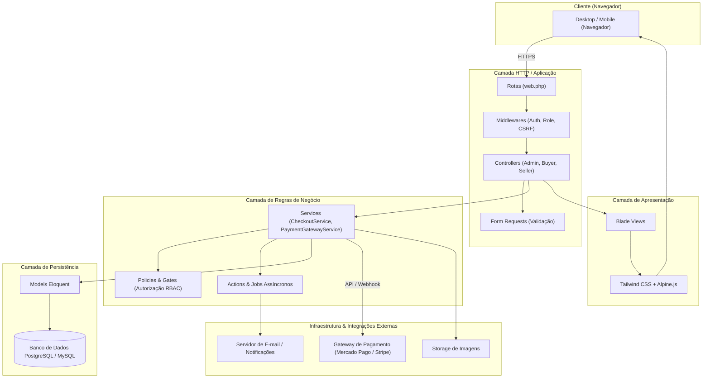
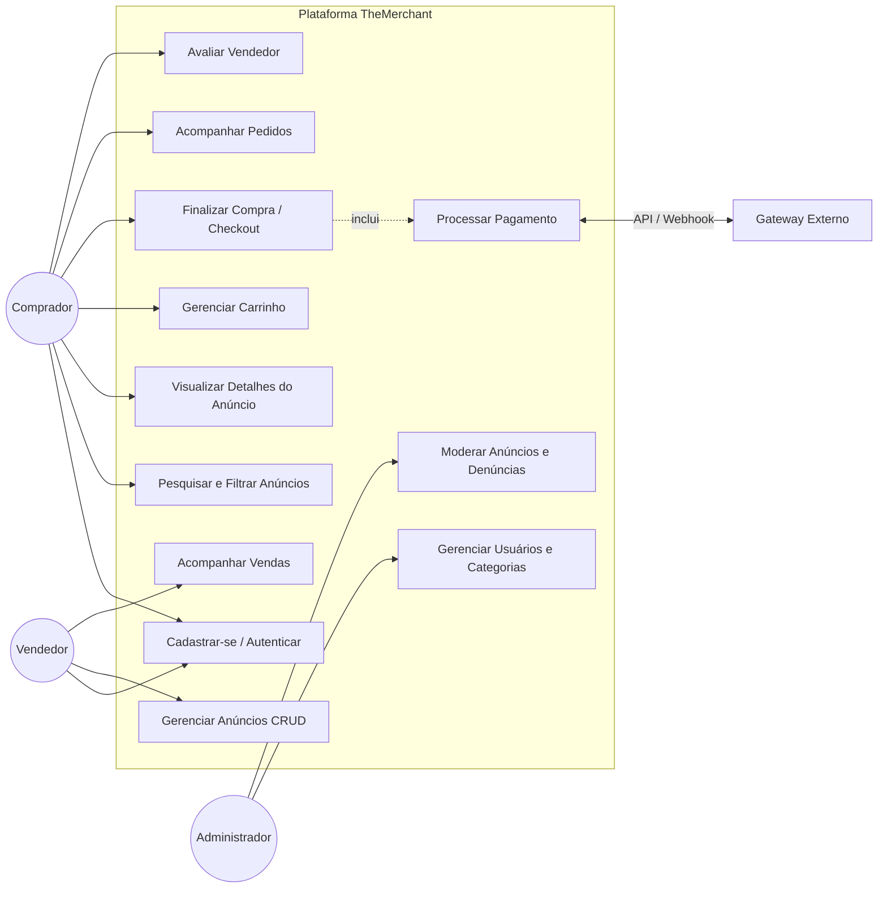
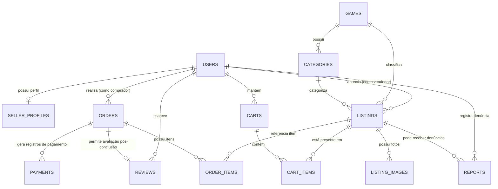

# TheMerchant

Marketplace web de cosméticos e serviços para jogos digitais, desenvolvido em **PHP/Laravel** para a disciplina **Laboratório de Engenharia de Software III — FATEC Praia Grande (2026)**.

A proposta é conectar compradores e vendedores com anúncios organizados, pedidos rastreáveis, pagamentos por gateway externo, reputação e moderação. Somente ofertas compatíveis com as regras do jogo ou plataforma fazem parte do escopo.

> **Em desenvolvimento.** Há código e rotas para os fluxos principais, mas nem todas as funcionalidades estão homologadas. O pagamento atual é simulado e o chat está planejado. Não utilizar esta versão para transações reais.

## Comece por aqui

- [Executar o projeto localmente](docs/EXECUCAO.md) — dependências, banco, configuração, contas de demonstração e solução de problemas.
- [Testes e validações](docs/TESTES.md) — comandos reproduzíveis, resultados conhecidos e roteiro de homologação.
- [Backlog e milestones](ISSUES.md) — requisitos, dependências e critérios de aceitação.

## O que estamos construindo

| Área | Funcionalidades previstas |
| :--- | :--- |
<<<<<<< Updated upstream
| **Comprador** | Pesquisa produtos e serviços, filtra por jogo/categoria, adiciona itens ao carrinho, realiza checkout via gateway externo, acompanha o status de seus pedidos e avalia o vendedor após a entrega. |
| **Vendedor** | Mantém perfil comercial, publica e faz a gestão dos seus anúncios (ativar, pausar, editar fotos/preço), acompanha pedidos das suas vendas e acumula reputação verificada. |
| **Administrador** | Gerencia catálogo de jogos e categorias, modera denúncias, suspende anúncios irregulares, audita transações e gerencia contas de usuários. |
=======
| Acesso | Cadastro, login/logout, perfis, recuperação de senha e verificação de e-mail |
| Catálogo | Jogos, categorias, anúncios com imagens, pesquisa e filtros por preço/reputação |
| Compra | Carrinho, quantidades, reserva de disponibilidade, checkout e confirmação por webhook |
| Pós-venda | Histórico, entrega de cosméticos, conclusão de coaching e avaliação por item comprado |
| Comunicação | Chat privado de texto com vendedor, histórico e mensagens não lidas |
| Administração | Gestão de usuários/categorias/jogos, denúncias, bloqueio e restauração de anúncios |
>>>>>>> Stashed changes

A v1 não contempla app nativo, integração direta com APIs dos jogos, carteira própria, múltiplas moedas/idiomas, anexos/áudio/vídeo/grupos no chat ou agenda automática de coaching.

O chat foi incluído no escopo em **18/09/2026** por meio de RF21–RF23. A revisão do PDF acadêmico e dos diagramas é acompanhada na [issue #33](https://github.com/IgorMarcoli/TheMerchant/issues/33).

## Estado atual

<<<<<<< Updated upstream
| ID | Prioridade | Descrição |
| :--- | :---: | :--- |
| **RF01** | Alta | O sistema deve permitir o cadastro de usuários com nome, e-mail e senha. |
| **RF02** | Alta | O sistema deve permitir login e logout de usuários cadastrados. |
| **RF03** | Alta | O sistema deve permitir verificação de e-mail e recuperação de senha. |
| **RF04** | Alta | O sistema deve aplicar permissões conforme o perfil do usuário: comprador, vendedor ou administrador. |
| **RF05** | Alta | O vendedor deve poder cadastrar, editar, pausar e remover seus próprios anúncios. |
| **RF06** | Alta | Cada anúncio deve permitir informar jogo, categoria, título, descrição, preço, imagens e status. |
| **RF07** | Alta | O comprador deve poder pesquisar, filtrar e ordenar anúncios por jogo, categoria e faixa de preço. |
| **RF08** | Alta | O sistema deve exibir uma página de detalhes do anúncio com informações do vendedor e avaliação. |
| **RF09** | Alta | O sistema deve disponibilizar carrinho de compras para o comprador. |
| **RF10** | Alta | O sistema deve permitir finalizar a compra por meio de checkout integrado a um gateway de pagamento. |
| **RF11** | Alta | O sistema deve registrar e atualizar o status do pagamento e do pedido, inclusive por notificações/webhooks do gateway. |
| **RF12** | Alta | O comprador deve poder acompanhar o histórico e o status de seus pedidos. |
| **RF13** | Média | O vendedor deve poder acompanhar as vendas relacionadas aos seus anúncios. |
| **RF14** | Média | O comprador deve poder avaliar o vendedor após a conclusão da compra. |
| **RF15** | Alta | O administrador deve poder gerenciar usuários, categorias, anúncios e denúncias. |

### Requisitos Não Funcionais (RNF)

| ID | Categoria | Descrição |
| :--- | :--- | :--- |
| **RNF01** | Usabilidade | A aplicação deve ser acessível por navegador web e possuir layout responsivo para desktop e dispositivos móveis. |
| **RNF02** | Segurança | As senhas devem ser armazenadas por hash seguro e irreversível (Bcrypt/Argon2id), nunca em texto puro ou criptografia reversível. |
| **RNF03** | Segurança | A aplicação deve aplicar autenticação, autorização por perfil (*Policies/Gates*), proteção CSRF e validação estrita em todas as operações sensíveis. |
| **RNF04** | Segurança | Dados sensíveis de cartão não devem ser armazenados pela plataforma; o processamento é 100% delegado ao gateway externo. |
| **RNF05** | Desempenho | Listagens e buscas devem responder em tempo adequado, com consultas paginadas e índices no banco de dados para campos de filtro frequentes. |
| **RNF06** | Integridade | Operações críticas de pedido e pagamento devem utilizar transações ACID (`DB::transaction`) no banco ao alterar múltiplos registros relacionados. |
| **RNF07** | Privacidade | Coletar apenas os dados necessários para a operação comercial, em conformidade com as boas práticas e legislação de privacidade (LGPD). |
| **RNF08** | Manutenibilidade | O código deve seguir organização em camadas (MVC + Services + Form Requests), padrões PSR-12, migrations versionadas e testes automatizados. |
| **RNF09** | Observabilidade | Falhas de integração, webhooks e erros críticos de sistema devem ser registrados em logs estruturados sem exposição de dados sensíveis. |

---

## 🚫 Limites de Escopo (Primeira Versão)

| Dentro do Escopo (v1) | Fora do Escopo (v1) |
=======
| Item | Situação verificada no código |
>>>>>>> Stashed changes
| :--- | :--- |
| Framework | Laravel **11.56.1** no ambiente inspecionado; Composer aceita Laravel 11/12 e PHP 8.2+ |
| Entrada da aplicação | A rota `/` retorna `Hello World`; o catálogo está em `/anuncios` |
| Interface | Blade com Tailwind e Alpine via CDN no layout; depende de internet |
| Assets | Há scripts npm para Vite, mas não há configuração Vite versionada nem integração `@vite` no layout |
| Pagamento | `PaymentGatewayService` gera uma preferência fictícia e retorna para uma rota local |
| Segurança | Revisão de diagnósticos e exposição de dados pendente na [#28](https://github.com/IgorMarcoli/TheMerchant/issues/28); execução somente local |
| Autenticação | Recuperação de acesso/verificação de e-mail pendentes na [#27](https://github.com/IgorMarcoli/TheMerchant/issues/27) |
| Testes | Três testes existentes; falta `UserFactory` e configuração padrão da suíte |
| Chat | Planejado nas [#30](https://github.com/IgorMarcoli/TheMerchant/issues/30), [#31](https://github.com/IgorMarcoli/TheMerchant/issues/31) e [#32](https://github.com/IgorMarcoli/TheMerchant/issues/32); Reverb/Echo ainda não integrados |

## Execução local resumida

Pré-requisitos: Git, PHP 8.2+ compatível com o lockfile, Composer 2 e MySQL. O guia completo inclui extensões e orientações para Windows.

<<<<<<< Updated upstream
| Camada / Função | Tecnologia | Descrição |
| :--- | :--- | :--- |
| **Linguagem & Back-end** | **PHP 8.2+ / Laravel 11/12** | Monólito modular baseado no padrão MVC do Laravel. |
| **Camada de Apresentação** | **Blade + Tailwind CSS + Alpine.js** | Renderização server-side rápida, estilização moderna e componentes interativos leves. |
| **Banco de Dados** | **PostgreSQL / MySQL** | Modelagem relacional estrita com migrations versionadas e Eloquent ORM. |
| **Autenticação & Autorização** | **Laravel Sessions & Policies** | Sessões seguras com cookies HTTP-only, CSRF e Laravel Policies/Gates. |
| **Integração de Pagamentos** | **Mercado Pago / Stripe / PagSeguro** | Camada de serviço desacoplada (`PaymentGatewayService`) com suporte a webhooks assíncronos e idempotência. |
| **Armazenamento de Arquivos** | **Laravel Storage (Disk Local / S3)** | Armazenamento de imagens de anúncios e perfis com links simbólicos públicos. |
| **Filas & Tarefas Assíncronas** | **Laravel Queues / Jobs** | Processamento em segundo plano para envio de e-mails, confirmação de webhooks e logs de auditoria. |
| **Testes Automatizados** | **Pest / PHPUnit** | Cobertura de testes unitários para Services e testes de feature para fluxos HTTP críticos. |
| **Versionamento & Ambiente** | **Git, GitHub & Docker (Sail)** | Padronização do ambiente de desenvolvimento e controle de versões via branches. |

---

## 🏛️ Arquitetura da Aplicação

A solução adota uma **arquitetura monolítica modular baseada em camadas no Laravel**:



### Diagrama de Casos de Uso



---

## 🗄️ Modelo de Dados Preliminar

A modelagem de dados foi projetada para garantir integridade referencial, rastreabilidade contábil e histórico imutável de transações.

| Entidade | Tabela | Finalidade |
| :--- | :--- | :--- |
| **User** | `users` | Dados de autenticação, status (ativo/suspenso) e papel do usuário (`buyer`, `seller`, `admin`). |
| **SellerProfile** | `seller_profiles` | Dados específicos de vendedor, bio, pontuação agregada de reputação e total de vendas. |
| **Game** | `games` | Catálogo de jogos suportados (ex: CS2, Valorant, League of Legends, Dota 2). |
| **Category** | `categories` | Categorias vinculadas a itens (ex: Skins de Arma, Facas, Coaching, Luvas). |
| **Listing** | `listings` | Anúncios de produtos ou serviços com título, descrição, preço e status. |
| **ListingImage** | `listing_images` | Galeria de imagens de cada anúncio, com flag de imagem principal. |
| **Cart** | `carts` | Carrinho de compras ativo do comprador (persistido por usuário ou sessão). |
| **CartItem** | `cart_items` | Itens e quantidades adicionados ao carrinho antes do checkout. |
| **Order** | `orders` | Pedido consolidado contendo valor total, comprador e status do fluxo de entrega. |
| **OrderItem** | `order_items` | Itens adquiridos no pedido, **preservando o preço histórico praticado** no momento da compra. |
| **Payment** | `payments` | Registro das tentativas de pagamento, transação externa do gateway, status e payload. |
| **Review** | `reviews` | Avaliações com nota (1 a 5) e comentário, vinculadas estritamente a uma compra concluída. |
| **Report** | `reports` | Denúncias de anúncios ou comportamentos irregulares enviadas para moderação administrativa. |

### Diagrama de Relacionamentos (ERD)



---

## 🔄 Ciclos de Vida e Regras de Negócio

### 1. Estados do Anúncio (`listings.status`)
- `rascunho`: Anúncio salvo pelo vendedor sem visibilidade pública no catálogo.
- `publicado`: Ativo e visível nas buscas e filtros.
- `pausado`: Temporariamente ocultado pelo vendedor.
- `vendido`: Item único já comercializado ou sem estoque disponível.
- `bloqueado`: Suspenso pela equipe de moderação administrativa por inconformidade com as regras.

### 2. Estados do Pedido (`orders.status`)
- `pendente`: Pedido gerado aguardando confirmação do gateway de pagamento.
- `pago`: Pagamento confirmado via webhook assíncrono.
- `em_andamento`: Vendedor notificado para liberação ou entrega do item/serviço digital.
- `concluido`: Entrega confirmada; habilita a avaliação do vendedor pelo comprador.
- `cancelado`: Pedido cancelado por expiração ou estorno.

---

## 🌐 Rotas Principais da Aplicação

| Método | Rota | Descrição | Acesso |
| :--- | :--- | :--- | :--- |
| `GET` | `/` | Página inicial com destaques, jogos populares e busca rápida | Público |
| `GET` | `/anuncios` | Catálogo geral com paginação, filtros e ordenação | Público |
| `GET` | `/anuncios/{slug}` | Detalhes do anúncio, galeria de fotos e dados do vendedor | Público |
| `GET/POST` | `/carrinho` | Visualização e manipulação do carrinho de compras | Comprador |
| `GET/POST` | `/checkout` | Resumo da compra e redirecionamento para o gateway | Comprador |
| `POST` | `/api/webhooks/payment` | Recebimento assíncrono de notificações de pagamento do gateway | Externo / Assíncrono |
| `GET` | `/pedidos` | Histórico e rastreamento dos pedidos realizados | Comprador |
| `POST` | `/pedidos/{id}/avaliar` | Envio de avaliação e nota para o vendedor | Comprador |
| `GET/POST` | `/vendedor/anuncios` | Painel do vendedor para CRUD e gestão de anúncios | Vendedor |
| `GET` | `/vendedor/vendas` | Acompanhamento de vendas recebidas e status de entrega | Vendedor |
| `GET` | `/admin/dashboard` | Métricas gerais de faturamento, usuários e volume de anúncios | Administrador |
| `GET/POST` | `/admin/denuncias` | Moderação de denúncias e suspensão de anúncios/usuários | Administrador |

---

## 🚀 Como Executar o Projeto

### Pré-requisitos
- **PHP 8.2 ou superior** com extensões ativas (`pdo`, `pdo_pgsql` ou `pdo_mysql`, `mbstring`, `openssl`, `curl`, `gd` ou `imagick`, `fileinfo`);
- **Composer 2.x**;
- **Node.js 18+** e **npm**;
- Banco de dados **PostgreSQL** ou **MySQL** (ou Docker).

---

### Opção 1: Execução Local com PHP & Node

```bash
# 1. Clone o repositório
=======
```powershell
>>>>>>> Stashed changes
git clone https://github.com/IgorMarcoli/TheMerchant.git
cd TheMerchant
composer install
if (!(Test-Path .env)) { Copy-Item .env.example .env }
```

Crie um banco **local dedicado** chamado `themerchant` e configure suas credenciais no `.env`. Para executar a base atual sem tabelas auxiliares ainda ausentes, ajuste:

```dotenv
APP_URL=http://127.0.0.1:8000
SESSION_DRIVER=file
CACHE_STORE=file
QUEUE_CONNECTION=sync
```

`sync` executa jobs na requisição: serve para desenvolvimento inicial, não comprova processamento assíncrono.

```powershell
php artisan config:clear
php artisan key:generate
php artisan migrate
php artisan db:seed
php artisan storage:link
php artisan serve --host=127.0.0.1 --port=8000
```

Gere a chave apenas na configuração inicial de um ambiente novo. Execute o seeder apenas na base nova: ele usa registros fixos e não é idempotente. Não é necessário iniciar Vite para o layout atual.

Abra [o catálogo local](http://127.0.0.1:8000/anuncios) ou [o login](http://127.0.0.1:8000/login). As contas fictícias e os passos detalhados estão no [guia de execução](docs/EXECUCAO.md).

## Testes rápidos

Verificações sem alterar o banco:

```powershell
composer validate --no-check-publish
composer check-platform-reqs
php artisan --version
php artisan route:list --except-vendor
php vendor/phpunit/phpunit/phpunit --no-configuration --bootstrap vendor/autoload.php tests/Unit/CheckoutServiceTest.php
```

O teste unitário existente verifica somente a instanciação do serviço. Para testes de feature, use o [ambiente isolado descrito no guia](docs/TESTES.md#2-testes-automatizados-no-estado-atual): os testes usam `RefreshDatabase` e não devem apontar para a base de desenvolvimento.

## Arquitetura e convenções

Monólito Laravel em camadas:

```text
Navegador → Rotas/Middleware → Controller + Form Request
                               ↓
                         Service + Policy
                               ↓
                       Eloquent / Banco / Jobs
                               ↓
                    Gateway e outras integrações
```

Controllers coordenam requisições; Form Requests validam; Services concentram regras de negócio; Policies/Gates autorizam. Operações que alteram múltiplas tabelas usam transações. Views são Blade com Tailwind e interações leves em Alpine.

As decisões de domínio estão em [requirements.md](requirements.md) e [specs.md](specs.md): reserva antes do pagamento, venda após confirmação, capacidade de coaching, uma avaliação por item pago/entregue e privacidade do chat.

## Roadmap

| Milestone | Entrega |
| :--- | :--- |
| [M1](https://github.com/IgorMarcoli/TheMerchant/milestone/10) | Fundação, autenticação e perfis; inclui pendências de RF03 e segurança |
| [M2](https://github.com/IgorMarcoli/TheMerchant/milestone/11) | Catálogo, anúncios, busca e regras de cosméticos/coaching |
| [M3](https://github.com/IgorMarcoli/TheMerchant/milestone/12) | Carrinho, reservas, checkout e pagamentos |
| [M4](https://github.com/IgorMarcoli/TheMerchant/milestone/13) | Pós-venda, entrega, reputação e chat |
| [M5](https://github.com/IgorMarcoli/TheMerchant/milestone/14) | Administração, moderação, qualidade e apresentação |

Consulte o GitHub para o estado atualizado; uma issue fechada não substitui evidência de teste.

## Documentação e contribuição

| Documento | Conteúdo |
| :--- | :--- |
| [Execução](docs/EXECUCAO.md) | Instalação, configuração e operação local |
| [Testes](docs/TESTES.md) | Testes automatizados, validação manual e evidências |
| [Requisitos](requirements.md) | RF01–RF23, RNF01–RNF09 e regras de negócio |
| [Especificações](specs.md) | Arquitetura, dados e contratos planejados |
| [Issues](ISSUES.md) | Backlog detalhado e rastreabilidade |
| [Contribuição](CONTRIBUTING.md) | Branches, Conventional Commits e revisão de PR |
| [Agentes](agents.md) | Instruções para assistência de IA |

Trabalhe em branch própria, preserve `.env` fora do Git e informe na PR os requisitos atendidos, testes realizados e limitações conhecidas.

## Equipe

- **Igor Marcoli Bastos** — [@IgorMarcoli](https://github.com/IgorMarcoli)
- **João Pedro Martins de Andrade** — [@JoaoPMA23](https://github.com/JoaoPMA23)

Projeto acadêmico — FATEC Praia Grande, LES III, 2026.
