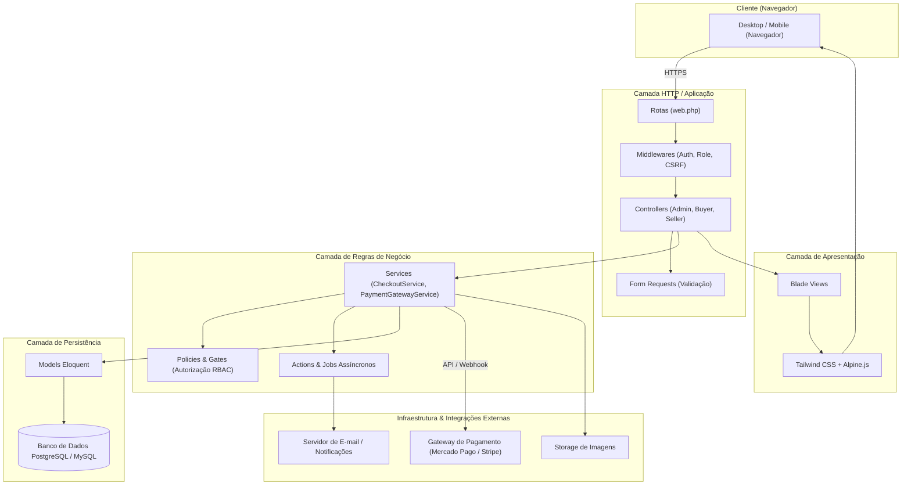
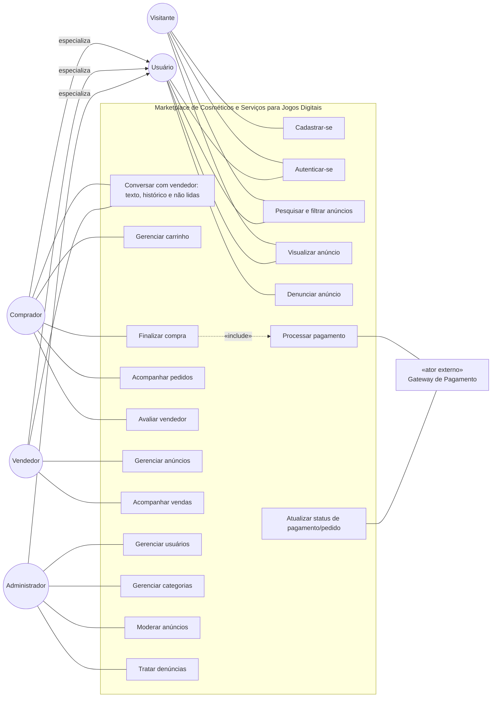
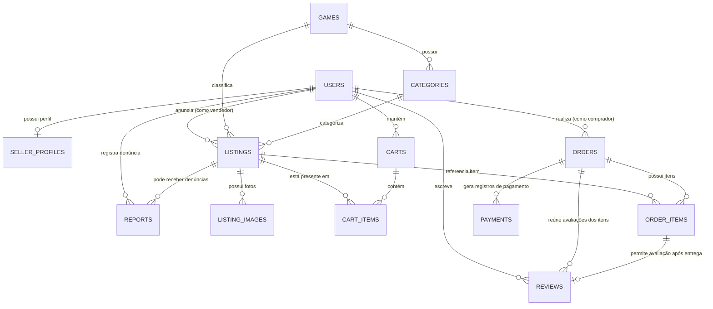

<div align="center">

# 🎮 TheMerchant

### Marketplace de cosméticos e serviços para jogos digitais

**Skins, coaching e conexões entre jogadores.**<br>
Projeto acadêmico de Laboratório de Engenharia de Software III · FATEC Praia Grande · 2026

<p>
  
  
</p>

<p>
  
  
  
  
  
</p>

<p>
  
  
  
  
  
  
</p>

<p>
  <a href="#sobre">Sobre</a> ·
  <a href="#tecnologias">Tecnologias</a> ·
  <a href="#requisitos">Requisitos</a> ·
  <a href="#arquitetura">Arquitetura</a> ·
  <a href="#executar">Executar</a> ·
  <a href="#testes">Testes</a> ·
  <a href="#roadmap">Roadmap</a>
</p>

</div>

---

> **Projeto em construção:** pagamento atualmente simulado e chat planejado. As seções abaixo apresentam o escopo e a arquitetura; o [guia de testes](docs/TESTES.md) registra o que foi efetivamente validado.

| 🚀 Executar localmente | 🧪 Validar a aplicação | 📌 Acompanhar entregas |
| :---: | :---: | :---: |
| [Guia de instalação e execução](docs/EXECUCAO.md) | [Guia de testes e validações](docs/TESTES.md) | [Issues e milestones](ISSUES.md) |

---

## 👥 Membros da Equipe

| Nome Completo | Matrícula / Função | GitHub |
| :--- | :--- | :--- |
| **Igor Marcoli Bastos** | Desenvolvedor Full-Stack | [@IgorMarcoli](https://github.com/IgorMarcoli) |
| **João Pedro Martins de Andrade** | Desenvolvedor Full-Stack | [@JoaoPMA23](https://github.com/JoaoPMA23) |

> 📌 *Este repositório e a documentação na raiz atendem às especificações e entregas do Laboratório de Engenharia de Software III (2026), documentando o escopo, arquitetura, requisitos e modelo de dados.*

---

<a id="sobre"></a>

## 📋 Sobre o Projeto e Justificativa

O mercado de jogos digitais expandiu de forma vertiginosa a demanda por **itens cosméticos** (como *skins*, temas visuais, pacotes gráficos e avatares) e **serviços associados** (como *coaching* e personalizações autorizadas).

Atualmente, grande parte dessas negociações acontece na informalidade — por meio de grupos de redes sociais, fóruns e mensageiros instantâneos. Nesses ambientes, os usuários enfrentam:
- **Ausência de padronização** nas ofertas e nos pagamentos;
- **Baixa rastreabilidade** das transações;
- **Alta vulnerabilidade** a golpes, fraudes, falsidade ideológica e chargebacks;
- **Inexistência de mecanismos de reputação e moderação** auditáveis.

O **TheMerchant** surge como uma plataforma web centralizada para intermediar transações entre compradores e vendedores com transparência, reputação verificada, integração segura com gateways de pagamento externos e moderação administrativa.

> ⚠️ **Observação de Escopo e Conformidade:** Itens e serviços somente poderão ser anunciados quando forem estritamente compatíveis com as políticas, termos de uso e restrições da publicadora do jogo ou plataforma correspondente.

---

## 🎯 Objetivos

### Objetivo geral
Desenvolver uma plataforma web de marketplace que permita anunciar, pesquisar, comprar e acompanhar produtos e serviços digitais relacionados a jogos, intermediando as negociações com segurança, rastreabilidade e controle administrativo.

### Objetivos específicos
- 🔐 Permitir cadastro, autenticação, recuperação de acesso e controle de perfis de usuário (*RBAC*).
- 📦 Possibilitar que vendedores cadastrem, editem, pausem e removam anúncios de produtos e serviços digitais com galeria de imagens.
- 🔍 Permitir pesquisa e filtragem estruturada por jogo, categoria, faixa de preço e avaliação do vendedor.
- 🛒 Disponibilizar carrinho de compras e fluxo seguro de checkout.
- 💳 Integrar a aplicação a um gateway de pagamento externo sem armazenar dados sensíveis de cartão na plataforma.
- 📈 Permitir o acompanhamento completo do status de pedidos (comprador) e vendas (vendedor).
- ⭐ Implementar avaliação e reputação de vendedores somente após uma compra efetivamente concluída.
- 🛡️ Disponibilizar painel administrativo para moderação de denúncias, anúncios, categorias e usuários.
- 🏛️ Construir a solução sobre uma arquitetura organizada, modular e de fácil manutenção utilizando PHP 8.2+ e o ecossistema Laravel.

---

## 👤 Perfis de Usuário

Uma pessoa usa a mesma conta para comprar e vender. `seller_profiles.status` controla a habilitação de vendas (`pending`, `approved`, `suspended`); `users.is_admin` concede administração separadamente. Administradores também precisam de perfil aprovado para criar seus próprios anúncios. Veja [o fluxo e a atualização do banco](docs/CONTAS_E_VENDEDORES.md).


| Perfil | Responsabilidades Principais |
| :--- | :--- |
| **Comprador** | Pesquisa produtos e serviços, gerencia o carrinho, finaliza compras, acompanha pedidos, avalia vendedores e pode denunciar anúncios. |
| **Vendedor** | Publica e gerencia seus próprios anúncios, acompanha vendas e utiliza as funcionalidades comuns disponíveis aos usuários da plataforma. |
| **Administrador** | Gerencia usuários e categorias, modera anúncios, trata denúncias e administra aspectos operacionais da plataforma. |

---

<a id="requisitos"></a>

## 📊 Requisitos do Sistema

### Requisitos Funcionais (RF)

| ID | Prioridade | Descrição |
| :--- | :---: | :--- |
| **RF01** | Alta | O sistema deve permitir que um visitante cadastre uma conta informando, no mínimo, nome, e-mail e senha, com uma conta única apta a comprar e solicitar aprovação para vender. |
| **RF02** | Alta | O sistema deve permitir autenticação, logout e controle de sessão de usuários cadastrados. |
| **RF03** | Alta | O sistema deve permitir verificação de e-mail e recuperação de acesso por meio de fluxo seguro. |
| **RF04** | Alta | Toda conta ativa pode comprar; vender exige perfil aprovado; administração depende de `users.is_admin`. |
| **RF05** | Alta | O vendedor deve poder cadastrar, editar, pausar e remover seus próprios anúncios. |
| **RF06** | Alta | Cada anúncio deve permitir informar jogo, categoria, título, descrição, preço, imagens e status. |
| **RF07** | Alta | O usuário deve poder pesquisar, filtrar e ordenar anúncios por jogo, categoria, faixa de preço e reputação do vendedor. |
| **RF08** | Alta | O sistema deve exibir uma página de detalhes do anúncio com informações do produto ou serviço, vendedor e reputação disponível. |
| **RF09** | Alta | O comprador deve poder gerenciar o carrinho, adicionando, removendo e ajustando itens antes da compra. |
| **RF10** | Alta | O comprador deve poder finalizar a compra por meio do checkout, gerando o pedido correspondente. |
| **RF11** | Alta | A finalização da compra deve incluir o processamento do pagamento por meio de um gateway externo. |
| **RF12** | Alta | O sistema deve receber notificações/webhooks do gateway e atualizar de forma idempotente os status do pagamento e do pedido. |
| **RF13** | Alta | O comprador deve poder acompanhar o histórico e o status de seus pedidos. |
| **RF14** | Média | O vendedor deve poder acompanhar as vendas relacionadas aos seus anúncios. |
| **RF15** | Média | O comprador deve poder avaliar o vendedor somente após a conclusão da compra. |
| **RF16** | Média | O usuário autenticado deve poder denunciar um anúncio, informando o motivo da denúncia. |
| **RF17** | Alta | O administrador deve poder gerenciar usuários, incluindo consulta, alteração de status e demais ações administrativas previstas pela plataforma. |
| **RF18** | Alta | O administrador deve poder gerenciar as categorias utilizadas para classificar anúncios. |
| **RF19** | Alta | O administrador deve poder moderar anúncios, podendo ocultar, bloquear ou restaurar anúncios conforme as regras da plataforma. |
| **RF20** | Alta | O administrador deve poder consultar e tratar denúncias registradas pelos usuários. |

### Chat em tempo real — ampliação de escopo

Incluído na v1 em 18/09/2026. A implementação está planejada nas issues #30–#32; atualização do PDF na #33.

| ID | Prioridade | Descrição |
| :--- | :---: | :--- |
| **RF21** | Alta | Iniciar e retomar conversa privada com o vendedor pelo anúncio ou pela compra. |
| **RF22** | Alta | Enviar e receber texto em tempo real, com persistência e autorização dos participantes. |
| **RF23** | Média | Consultar histórico, mensagens não lidas e recuperar mensagens após reconexão. |

### Requisitos Não Funcionais (RNF)

| ID | Categoria | Descrição |
| :--- | :--- | :--- |
| **RNF01** | Usabilidade | A aplicação deve ser acessível por navegador web e possuir layout responsivo para desktop e dispositivos móveis. |
| **RNF02** | Segurança | As senhas devem ser armazenadas por hash seguro e irreversível (Bcrypt/Argon2id), nunca em texto puro ou criptografia reversível. |
| **RNF03** | Segurança | A aplicação deve aplicar autenticação, autorização por perfil (*Policies/Gates*), proteção CSRF e validação estrita em todas as operações sensíveis. |
| **RNF04** | Segurança | Dados sensíveis de cartão não devem ser armazenados pela plataforma; o processamento é 100% delegado ao gateway externo. |
| **RNF05** | Desempenho | Listagens e buscas devem responder em tempo adequado, com consultas paginadas e índices no banco de dados para campos de filtro frequentes. |
| **RNF06** | Integridade | Operações críticas de pedido e pagamento devem utilizar transações ACID (`DB::transaction`) no banco ao alterar múltiplos registros relacionados. |
| **RNF07** | Privacidade | Coletar apenas os dados necessários para a operação comercial, em conformidade com as boas práticas e legislação de privacidade (LGPD). |
| **RNF08** | Manutenibilidade | O código deve seguir organização em camadas (MVC + Services + Form Requests), padrões PSR-12, migrations versionadas e testes automatizados. |
| **RNF09** | Observabilidade | Falhas de integração, webhooks e erros críticos de sistema devem ser registrados em logs estruturados sem exposição de dados sensíveis. |

---

## 🚫 Limites de Escopo (Primeira Versão)

| Dentro do Escopo (v1) | Fora do Escopo (v1) |
| :--- | :--- |
| ✅ Aplicação web 100% responsiva (Desktop / Mobile) | ❌ Aplicativo mobile nativo (iOS / Android) |
| ✅ Catálogo, carrinho, checkout e webhook assíncrono | ❌ Integração direta com APIs oficiais de jogos (Steam, Riot) |
| ✅ Reputação pós-compra e chat privado de texto com vendedor | ❌ Anexos, áudio/vídeo e grupos no chat |
| ✅ Painel administrativo de moderação e denúncias | ❌ Múltiplos idiomas e múltiplas moedas (foco BRL) |
| ✅ Gateway externo (Mercado Pago / Stripe / PagSeguro) | ❌ Carteira financeira própria ou custódia interna de valores |
| ✅ Coaching com sessões, capacidade e combinação de horários | ❌ Agenda automática de coaching |

---

<a id="tecnologias"></a>

## 🛠️ Stack Tecnológica

**Linguagens:** PHP no backend; JavaScript nas interações; HTML e CSS na apresentação. O ambiente inspecionado utiliza Laravel 11.56.1. Composer admite 11/12; MySQL é o caminho local documentado.

| Camada / Função | Tecnologia | Descrição |
| :--- | :--- | :--- |
| **Linguagem & Back-end** | **PHP 8.2+ / Laravel 11/12** | Monólito modular baseado no padrão MVC do Laravel. |
| **Camada de Apresentação** | **Blade + Tailwind CSS + Alpine.js** | Renderização server-side rápida, estilização moderna e componentes interativos leves. |
| **Banco de Dados** | **MySQL / PostgreSQL previsto** | Migrations e Eloquent; os diagnósticos atuais usam SQL específico de MySQL. |
| **Autenticação & Autorização** | **Laravel Sessions & Policies** | Sessões seguras com cookies HTTP-only, CSRF e Laravel Policies/Gates. |
| **Integração de Pagamentos** | **Mercado Pago / Stripe / PagSeguro** | Camada de serviço desacoplada (`PaymentGatewayService`) com suporte a webhooks assíncronos e idempotência. |
| **Armazenamento de Arquivos** | **Laravel Storage (Disk Local / S3)** | Armazenamento de imagens de anúncios e perfis com links simbólicos públicos. |
| **Filas & Tarefas Assíncronas** | **Laravel Queues / Jobs** | Processamento em segundo plano para envio de e-mails, confirmação de webhooks e logs de auditoria. |
| **Testes Automatizados** | **Pest / PHPUnit** | Cobertura de testes unitários para Services e testes de feature para fluxos HTTP críticos. |
| **Versionamento** | **Git + GitHub** | Branches, revisão de código e acompanhamento de entregas. |
| **Chat planejado** | **Laravel Reverb + Echo** | Mensagens em canais privados, histórico e reconexão; ainda não implementado. |
| **Evoluções de ambiente** | **Vite / Docker (Sail)** | Dependências declaradas; configurações de build/Compose ainda não versionadas. |

---

<a id="arquitetura"></a>

## 🏛️ Arquitetura da Aplicação

A solução adota uma **arquitetura monolítica modular baseada em camadas no Laravel**:



### Visão dos casos de uso

A visualização Mermaid resume os casos de uso; o diagrama UML formal é mantido no documento acadêmico. O ator **Usuário** é uma abstração de modelagem — não uma conta separada para cada atividade — e é especializado pelos atores **Comprador**, **Vendedor** e **Administrador** via herança/generalização; os atores representam capacidades que podem coexistir na mesma conta. O **Visitante** representa quem ainda não possui conta, enquanto o **Gateway de Pagamento** atua como ator externo.



#### Critérios de Modelagem UML Aplicados
- **Associações contínuas:** Associações entre atores e casos de uso representadas por linhas contínuas, sem setas.
- **Generalização de Atores:** Comprador, Vendedor e Administrador especializam o ator geral `Usuário`, herdando as ações comuns.
- **Relacionamento `<<include>>` estrito:** O único relacionamento obrigatório entre casos de uso é `Finalizar compra <<include>> Processar pagamento`.
- **Independência de Carrinho e Checkout:** `Gerenciar carrinho` e `Finalizar compra` não possuem relacionamento direto no diagrama, pois representam sequência de fluxo e não relação de caso de uso.
- **Ações administrativas atômicas:** `Gerenciar usuários`, `Gerenciar categorias`, `Moderar anúncios` e `Tratar denúncias` são casos de uso separados e atômicos.
- **Gateway como Ator Externo:** Participa ativamente dos casos `Processar pagamento` e `Atualizar status de pagamento/pedido`.

---

## 🗄️ Modelo de Dados Preliminar

A modelagem de dados foi projetada para garantir integridade referencial, rastreabilidade contábil e histórico imutável de transações.

| Entidade | Tabela | Finalidade |
| :--- | :--- | :--- |
| **User** | `users` | Dados de autenticação, status (ativo/suspenso) e papel do usuário (`buyer`, `seller`, `admin`). |
| **SellerProfile** | `seller_profiles` | Dados específicos de vendedor, bio, pontuação agregada de reputação e total de vendas. |
| **Game** | `games` | Catálogo de jogos suportados (ex: CS2, Valorant, League of Legends, Dota 2). |
| **Category** | `categories` | Categorias vinculadas a itens (ex: Skins de Arma, Facas, Coaching, Luvas). |
| **Listing** | `listings` | Anúncios de produtos ou serviços com título, descrição, preço e status. |
| **ListingImage** | `listing_images` | Galeria de imagens de cada anúncio, com flag de imagem principal. |
| **Cart** | `carts` | Carrinho de compras ativo do comprador (persistido por usuário ou sessão). |
| **CartItem** | `cart_items` | Itens e quantidades adicionados ao carrinho antes do checkout. |
| **Order** | `orders` | Pedido consolidado contendo valor total, comprador e status do fluxo de entrega. |
| **OrderItem** | `order_items` | Itens adquiridos no pedido, **preservando o preço histórico praticado** no momento da compra. |
| **Payment** | `payments` | Registro das tentativas de pagamento, transação externa do gateway, status e payload. |
| **Review** | `reviews` | Avaliações com nota (1 a 5) e comentário, vinculadas estritamente a uma compra concluída. |
| **Report** | `reports` | Denúncias de anúncios ou comportamentos irregulares enviadas para moderação administrativa. |

### Diagrama de Relacionamentos (ERD)



---

## 🔄 Ciclos de Vida e Regras de Negócio

> **Regra planejada:** checkout cria reserva com expiração; aprovação confirma a venda. Coaching mantém disponibilidade conforme capacidade. Detalhes em [requirements.md](requirements.md) e na #29.

### 1. Estados do Anúncio (`listings.status`)
- `rascunho`: Anúncio salvo pelo vendedor sem visibilidade pública no catálogo.
- `publicado`: Ativo e visível nas buscas e filtros.
- `pausado`: Temporariamente ocultado pelo vendedor.
- `vendido`: Item único já comercializado ou sem estoque disponível.
- `bloqueado`: Suspenso pela equipe de moderação administrativa por inconformidade com as regras.

### 2. Estados do Pedido (`orders.status`)
- `pendente`: Pedido gerado aguardando confirmação do gateway de pagamento.
- `pago`: Pagamento confirmado via webhook assíncrono.
- `em_andamento`: Vendedor notificado para liberação ou entrega do item/serviço digital.
- `concluido`: Todos os itens entregues; avaliação é habilitada por item pago e entregue, sem aguardar outros vendedores.
- `cancelado`: Pedido cancelado por expiração ou estorno.

---

## 🌐 Rotas Principais da Aplicação

| Método | Rota | Descrição | Acesso |
| :--- | :--- | :--- | :--- |
| `GET` | `/` | Atualmente `Hello World`; vitrine prevista na #9 | Público |
| `GET` | `/anuncios` | Catálogo geral com paginação, filtros e ordenação | Público |
| `GET` | `/anuncios/{slug}` | Detalhes do anúncio, galeria de fotos e dados do vendedor | Público |
| `GET` / `POST` | `/carrinho` / `/carrinho/adicionar/{listing}` | Consultar carrinho / adicionar item | Autenticado |
| `GET` / `POST` | `/checkout` / `/checkout/processar` | Resumo / processamento da compra | Autenticado |
| `POST` | `/api/webhooks/payment` | Recebimento assíncrono de notificações de pagamento do gateway | Externo / Assíncrono |
| `GET` | `/pedidos` | Histórico e rastreamento dos pedidos realizados | Comprador |
| `POST` | `/pedidos/{order}/avaliar/{item}` | Envio de avaliação e nota para o vendedor | Comprador |
| `GET/POST` | `/vendedor/anuncios` | Painel do vendedor para CRUD e gestão de anúncios | Vendedor |
| `GET` | `/vendedor/vendas` | Acompanhamento de vendas recebidas e status de entrega | Vendedor |
| `GET` | `/admin/dashboard` | Métricas gerais de faturamento, usuários e volume de anúncios | Administrador |
| `GET` / `PATCH` | `/admin/denuncias` / `/admin/denuncias/{report}/moderar` | Consulta / julgamento de denúncias | Administrador |

---

<a id="executar"></a>

## 🚀 Como Executar o Projeto

Pré-requisitos: PHP 8.2+ compatível com o lockfile, Composer 2 e MySQL. Consulte o [guia completo](docs/EXECUCAO.md) para extensões, contas de demonstração, filas e solução de problemas.

```powershell
git clone https://github.com/IgorMarcoli/TheMerchant.git
cd TheMerchant
composer install
if (!(Test-Path .env)) { Copy-Item .env.example .env }
```

Crie um banco **local dedicado** chamado `themerchant` e configure suas credenciais no `.env`. Para executar a base atual sem tabelas auxiliares ainda ausentes, ajuste:

```dotenv
APP_URL=http://127.0.0.1:8000
SESSION_DRIVER=file
CACHE_STORE=file
QUEUE_CONNECTION=sync
```

`sync` executa jobs na requisição: serve para desenvolvimento inicial, não comprova processamento assíncrono.

```powershell
php artisan config:clear
php artisan key:generate
php artisan migrate
php artisan db:seed
php artisan storage:link
php artisan serve --host=127.0.0.1 --port=8000
```

Gere a chave apenas na configuração inicial de um ambiente novo. Execute o seeder apenas na base nova: ele usa registros fixos e não é idempotente. Não é necessário iniciar Vite para o layout atual.

Abra [o catálogo local](http://127.0.0.1:8000/anuncios) ou [o login](http://127.0.0.1:8000/login). As contas fictícias e os passos detalhados estão no [guia de execução](docs/EXECUCAO.md).

<a id="testes"></a>

## 🧪 Testes e Validações

Verificações sem alterar o banco:

```powershell
composer validate --no-check-publish
composer check-platform-reqs
php artisan --version
php artisan route:list --except-vendor
php vendor/phpunit/phpunit/phpunit --no-configuration --bootstrap vendor/autoload.php tests/Unit/CheckoutServiceTest.php
```

O teste unitário existente verifica somente a instanciação do serviço. Para testes de feature, use o [ambiente isolado descrito no guia](docs/TESTES.md#2-testes-automatizados-no-estado-atual): os testes usam `RefreshDatabase` e não devem apontar para a base de desenvolvimento.


---

## 📁 Estrutura de Pastas do Projeto

```
TheMerchant/
├── .env.example                     # Exemplo de configurações de ambiente
├── .gitignore                       # Regras de exclusão do Git
├── CONTRIBUTING.md                  # Guia de contribuição, Git Flow e padrões de código
├── README.md                        # Documento principal do projeto
├── agents.md                        # Diretrizes para automação e agentes de IA
├── requirements.md                  # Especificação formal de requisitos (RF / RNF)
├── specs.md                         # Especificações técnicas, ERD detalhado e rotas
├── composer.json                    # Dependências do ecossistema PHP/Laravel
├── package.json                     # Dependências do ecossistema Node/Tailwind/Vite
├── docs/
│   ├── EXECUCAO.md                  # Instalação e operação local
│   └── TESTES.md                    # Testes, validação manual e evidências
├── app/
│   ├── Http/
│   │   ├── Controllers/
│   │   │   ├── Admin/               # Controladores do painel administrativo
│   │   │   │   ├── CategoryController.php
│   │   │   │   ├── DashboardController.php
│   │   │   │   ├── ReportController.php
│   │   │   │   └── UserController.php
│   │   │   ├── Buyer/               # Controladores da jornada do comprador
│   │   │   │   ├── CartController.php
│   │   │   │   ├── CheckoutController.php
│   │   │   │   ├── OrderController.php
│   │   │   │   └── ReviewController.php
│   │   │   ├── Seller/              # Controladores do painel do vendedor
│   │   │   │   ├── ListingController.php
│   │   │   │   └── SaleController.php
│   │   │   ├── Auth/                # Autenticação e controle de sessões
│   │   │   ├── ListingPublicController.php
│   │   │   ├── WebhookController.php
│   │   │   └── Controller.php
│   │   └── Requests/                # Form Requests com validações de entrada
│   │       ├── CheckoutRequest.php
│   │       └── ListingStoreRequest.php
│   ├── Models/                      # Entidades Eloquent ORM
│   │   ├── Cart.php
│   │   ├── CartItem.php
│   │   ├── Category.php
│   │   ├── Game.php
│   │   ├── Listing.php
│   │   ├── ListingImage.php
│   │   ├── Order.php
│   │   ├── OrderItem.php
│   │   ├── Payment.php
│   │   ├── Report.php
│   │   ├── Review.php
│   │   ├── SellerProfile.php
│   │   └── User.php
│   ├── Policies/                    # Regras de autorização por perfil (RBAC)
│   │   ├── ListingPolicy.php
│   │   └── OrderPolicy.php
│   ├── Services/                    # Camada de serviços e regras de negócio
│   │   ├── CheckoutService.php
│   │   └── PaymentGatewayService.php
│   ├── Jobs/                        # Tarefas assíncronas (webhooks, e-mails)
│   │   └── ProcessPaymentWebhookJob.php
│   └── Notifications/               # Notificações do sistema
│       └── OrderPaidNotification.php
├── bootstrap/
│   └── app.php                      # Inicializador do kernel Laravel
├── database/
│   ├── migrations/                  # Versionamento de tabelas do banco de dados
│   │   ├── 2026_01_01_000001_create_users_table.php
│   │   ├── 2026_01_01_000002_create_seller_profiles_table.php
│   │   ├── 2026_01_01_000003_create_games_table.php
│   │   ├── 2026_01_01_000004_create_categories_table.php
│   │   ├── 2026_01_01_000005_create_listings_and_images_tables.php
│   │   ├── 2026_01_01_000006_create_carts_and_items_tables.php
│   │   ├── 2026_01_01_000007_create_orders_and_items_tables.php
│   │   ├── 2026_01_01_000008_create_payments_table.php
│   │   ├── 2026_01_01_000009_create_reviews_table.php
│   │   └── 2026_01_01_000010_create_reports_table.php
│   └── seeders/                     # Povoamento inicial para testes e demonstração
│       └── DatabaseSeeder.php
├── resources/
│   ├── views/                       # Templates Blade da interface
│   │   ├── layouts/
│   │   │   ├── app.blade.php
│   │   │   └── navigation.blade.php
│   │   ├── listings/
│   │   │   ├── index.blade.php
│   │   │   └── show.blade.php
│   │   ├── cart/
│   │   ├── checkout/
│   │   ├── orders/
│   │   ├── seller/
│   │   └── admin/
│   ├── css/
│   │   └── app.css                  # Folhas de estilo (Tailwind CSS)
│   └── js/
│       └── app.js                   # Scripts Alpine.js / Vite
├── routes/
│   ├── web.php                      # Rotas da interface web
│   ├── api.php                      # Endpoints de webhooks e integrações
│   └── console.php                  # Comandos Artisan customizados
└── tests/
    ├── Feature/                     # Testes de integração de fluxos HTTP
    │   ├── CheckoutTest.php
    │   └── WebhookPaymentTest.php
    └── Unit/                        # Testes unitários de serviços e regras
        └── CheckoutServiceTest.php
```

---

<a id="roadmap"></a>

## 🗺️ Roadmap

| Milestone | Entrega |
| :--- | :--- |
| [M1](https://github.com/IgorMarcoli/TheMerchant/milestone/10) | Fundação, autenticação e perfis; inclui pendências de RF03 e segurança |
| [M2](https://github.com/IgorMarcoli/TheMerchant/milestone/11) | Catálogo, anúncios, busca e regras de cosméticos/coaching |
| [M3](https://github.com/IgorMarcoli/TheMerchant/milestone/12) | Carrinho, reservas, checkout e pagamentos |
| [M4](https://github.com/IgorMarcoli/TheMerchant/milestone/13) | Pós-venda, entrega, reputação e chat |
| [M5](https://github.com/IgorMarcoli/TheMerchant/milestone/14) | Administração, moderação, qualidade e apresentação |

Consulte o GitHub para o estado atualizado; uma issue fechada não substitui evidência de teste.


---

## 📑 Documentação Complementar

- 🚀 [Guia de Execução](docs/EXECUCAO.md) — Instalação, `.env`, banco, filas e problemas frequentes.
- 🧪 [Guia de Testes](docs/TESTES.md) — Comandos isolados, matriz de validação e evidências.

- 📋 [Requisitos Detalhados (`requirements.md`)](./requirements.md) — Matriz completa de Requisitos Funcionais, Não Funcionais e Regras de Negócio.
- 📐 [Especificações Técnicas & ERD (`specs.md`)](./specs.md) — Dicionário de dados, máquina de estados e contratos dos Services.
- 📌 [Planejamento de Sprints & Issues (`ISSUES.md`)](./ISSUES.md) — Backlog dividido em 5 Milestones com distribuição equilibrada de tarefas da equipe.
- 🤝 [Guia de Contribuição (`CONTRIBUTING.md`)](./CONTRIBUTING.md) — Diretrizes de Git Flow, branches e commits semânticos.
- 🤖 [Diretrizes para Agentes (`agents.md`)](./agents.md) — Contexto de desenvolvimento e padrões arquiteturais para automações e LLMs.

---

## 📄 Licença

Projeto desenvolvido para fins acadêmicos na FATEC Praia Grande. O `composer.json` declara licença MIT; conferir a inclusão do arquivo de licença antes da distribuição.
