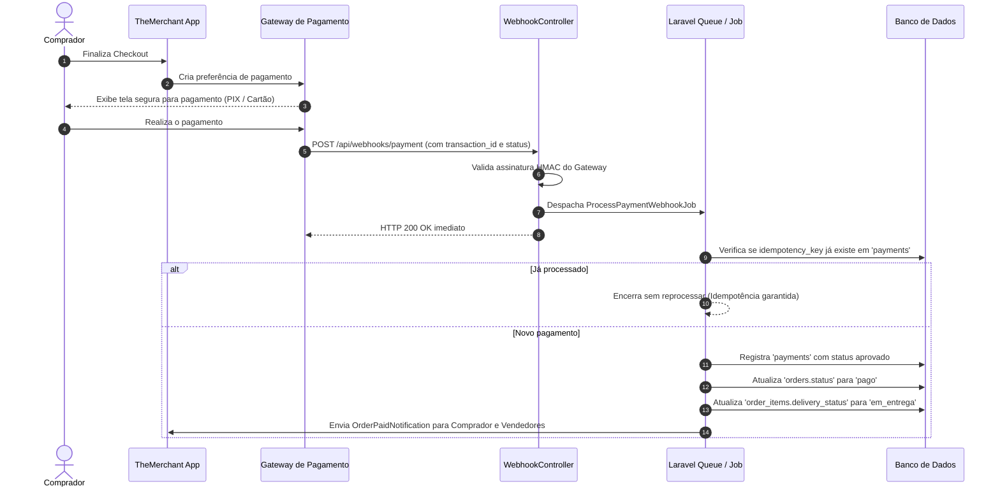

# 📐 Especificações Técnicas e Arquiteturais — TheMerchant

> **Documento de Arquitetura de Software e Especificação Técnica**  
> **Projeto:** TheMerchant (Marketplace de Cosméticos e Serviços para Jogos Digitais)  
> **Stack:** PHP 8.2+, Laravel 11/12, Blade, Tailwind CSS, Alpine.js, PostgreSQL / MySQL  

---

## 1. Visão Arquitetural

O **TheMerchant** segue o padrão de **Monólito Modular em Camadas**, tirando proveito da robustez do ecossistema Laravel. Esta abordagem mantém o front-end (Blade + Tailwind CSS + Alpine.js) e o back-end no mesmo repositório, simplificando o deploy, testes e manutenção, enquanto isola as regras de negócio em uma **Camada de Serviços (*Service Layer*)**, permitindo que futuras interfaces (como um App Mobile via API REST ou SPA em Inertia/Vue) reutilizem a mesma inteligência de domínio sem duplicação de código.

```
[ Navegador Web ]
       │  (HTTPS / CSRF Token / Cookie de Sessão)
       ▼
[ Camada de Roteamento (routes/web.php) ]
       │
[ Middlewares (Authenticate, CheckRole, VerifyCsrfToken) ]
       │
[ Controllers (Http/Controllers) ] ──> [ Form Requests (Validação) ]
       │
       ▼
[ Camada de Serviços (app/Services) ] ──> [ Policies (app/Policies) ]
   ├── CheckoutService
   └── PaymentGatewayService
       │
       ├──────────────────────────────┬──────────────────────────────┐
       ▼                              ▼                              ▼
[ Eloquent Models & DB ]      [ Jobs & Queues ]             [ Gateway Externo ]
(PostgreSQL / MySQL)          (Webhooks / E-mails)          (Mercado Pago / Stripe)
```

---

## 2. Dicionário de Dados e Modelo Físico

### 2.1 Tabela `users`
Armazena credenciais e dados de perfil de todos os usuários da plataforma.

| Campo | Tipo | Nulo | Descrição |
| :--- | :--- | :---: | :--- |
| `id` | `BIGINT UNSIGNED AUTO_INCREMENT` | Não | Chave primária |
| `name` | `VARCHAR(120)` | Não | Nome completo de exibição |
| `email` | `VARCHAR(150)` | Não | E-mail único para autenticação |
| `email_verified_at` | `TIMESTAMP` | Sim | Data da confirmação de e-mail |
| `password` | `VARCHAR(255)` | Não | Hash seguro da senha |
| `role` | `ENUM('buyer', 'seller', 'admin')` | Não | Papel de acesso principal (default: `buyer`) |
| `status` | `ENUM('active', 'suspended')` | Não | Estado da conta (default: `active`) |
| `remember_token` | `VARCHAR(100)` | Sim | Token para recurso "Lembrar-me" |
| `created_at` / `updated_at` | `TIMESTAMP` | Sim | Timestamps do Eloquent |

### 2.2 Tabela `seller_profiles`
Metadados específicos para usuários que operam como vendedores.

| Campo | Tipo | Nulo | Descrição |
| :--- | :--- | :---: | :--- |
| `id` | `BIGINT UNSIGNED AUTO_INCREMENT` | Não | Chave primária |
| `user_id` | `BIGINT UNSIGNED` | Não | FK para `users.id` (Unique, 1:1) |
| `bio` | `TEXT` | Sim | Descrição comercial e apresentação |
| `reputation_score` | `DECIMAL(3,2)` | Não | Média agregada de avaliações (0.00 a 5.00) |
| `total_reviews` | `INT UNSIGNED` | Não | Total de avaliações recebidas (default: 0) |
| `total_sales` | `INT UNSIGNED` | Não | Total de itens vendidos com sucesso (default: 0) |
| `created_at` / `updated_at` | `TIMESTAMP` | Sim | Timestamps do Eloquent |

### 2.3 Tabela `games`
Catálogo oficial dos jogos suportados pela plataforma.

| Campo | Tipo | Nulo | Descrição |
| :--- | :--- | :---: | :--- |
| `id` | `BIGINT UNSIGNED AUTO_INCREMENT` | Não | Chave primária |
| `name` | `VARCHAR(100)` | Não | Nome do jogo (ex: Counter-Strike 2, Valorant) |
| `slug` | `VARCHAR(120)` | Não | Slug único para URLs amigáveis |
| `cover_image` | `VARCHAR(255)` | Sim | Caminho no storage da imagem de capa |
| `active` | `BOOLEAN` | Não | Se o jogo aceita novos anúncios (default: `true`) |
| `created_at` / `updated_at` | `TIMESTAMP` | Sim | Timestamps do Eloquent |

### 2.4 Tabela `categories`
Categorização hierárquica vinculada ou não a jogos específicos.

| Campo | Tipo | Nulo | Descrição |
| :--- | :--- | :---: | :--- |
| `id` | `BIGINT UNSIGNED AUTO_INCREMENT` | Não | Chave primária |
| `game_id` | `BIGINT UNSIGNED` | Sim | FK opcional para `games.id` |
| `name` | `VARCHAR(100)` | Não | Nome da categoria (ex: Facas, Skins de Armas, Coaching) |
| `slug` | `VARCHAR(120)` | Não | Slug único para busca |
| `type` | `ENUM('cosmetic', 'service')` | Não | Natureza do item comercializado |
| `created_at` / `updated_at` | `TIMESTAMP` | Sim | Timestamps do Eloquent |

### 2.5 Tabela `listings`
Armazena as publicações de cosméticos e serviços feitas pelos vendedores.

| Campo | Tipo | Nulo | Descrição |
| :--- | :--- | :---: | :--- |
| `id` | `BIGINT UNSIGNED AUTO_INCREMENT` | Não | Chave primária |
| `seller_id` | `BIGINT UNSIGNED` | Não | FK para `users.id` (o vendedor anunciante) |
| `game_id` | `BIGINT UNSIGNED` | Não | FK para `games.id` |
| `category_id` | `BIGINT UNSIGNED` | Não | FK para `categories.id` |
| `title` | `VARCHAR(150)` | Não | Título atrativo do anúncio |
| `slug` | `VARCHAR(180)` | Não | Slug único com hash para URL do produto |
| `description` | `TEXT` | Não | Detalhes, especificações e condições de entrega |
| `price` | `DECIMAL(10,2)` | Não | Valor em reais (mínimo R$ 1,00) |
| `status` | `ENUM('rascunho', 'publicado', 'pausado', 'vendido', 'bloqueado')` | Não | Estado atual do anúncio |
| `views_count` | `INT UNSIGNED` | Não | Contador de visualizações (default: 0) |
| `created_at` / `updated_at` | `TIMESTAMP` | Sim | Timestamps do Eloquent |

### 2.6 Tabela `listing_images`
Galeria de imagens anexadas ao anúncio.

| Campo | Tipo | Nulo | Descrição |
| :--- | :--- | :---: | :--- |
| `id` | `BIGINT UNSIGNED AUTO_INCREMENT` | Não | Chave primária |
| `listing_id` | `BIGINT UNSIGNED` | Não | FK para `listings.id` com `cascadeOnDelete` |
| `image_path` | `VARCHAR(255)` | Não | Caminho relativo no storage público |
| `is_primary` | `BOOLEAN` | Não | Se é a imagem de capa (default: `false`) |
| `display_order` | `SMALLINT UNSIGNED`| Não | Ordem de exibição no carrossel |
| `created_at` / `updated_at` | `TIMESTAMP` | Sim | Timestamps do Eloquent |

### 2.7 Tabela `carts` e `cart_items`
Controle do carrinho persistido por usuário autenticado.

```sql
-- carts
id BIGINT UNSIGNED AUTO_INCREMENT PRIMARY KEY,
user_id BIGINT UNSIGNED NOT NULL UNIQUE (FK users.id),
created_at, updated_at TIMESTAMP

-- cart_items
id BIGINT UNSIGNED AUTO_INCREMENT PRIMARY KEY,
cart_id BIGINT UNSIGNED NOT NULL (FK carts.id, cascade),
listing_id BIGINT UNSIGNED NOT NULL (FK listings.id),
quantity INT UNSIGNED NOT NULL DEFAULT 1,
unit_price DECIMAL(10,2) NOT NULL,
created_at, updated_at TIMESTAMP
```

### 2.8 Tabela `orders` e `order_items`
Registro imutável dos pedidos gerados.

```sql
-- orders
id BIGINT UNSIGNED AUTO_INCREMENT PRIMARY KEY,
order_number VARCHAR(32) NOT NULL UNIQUE,
buyer_id BIGINT UNSIGNED NOT NULL (FK users.id),
total_amount DECIMAL(10,2) NOT NULL,
status ENUM('pendente', 'pago', 'em_andamento', 'concluido', 'cancelado') NOT NULL DEFAULT 'pendente',
notes TEXT NULL,
created_at, updated_at TIMESTAMP

-- order_items
id BIGINT UNSIGNED AUTO_INCREMENT PRIMARY KEY,
order_id BIGINT UNSIGNED NOT NULL (FK orders.id, cascade),
listing_id BIGINT UNSIGNED NOT NULL (FK listings.id),
seller_id BIGINT UNSIGNED NOT NULL (FK users.id),
unit_price DECIMAL(10,2) NOT NULL, -- Preço congelado no ato da compra
quantity INT UNSIGNED NOT NULL DEFAULT 1,
delivery_status ENUM('aguardando_pagamento', 'em_entrega', 'entregue') NOT NULL DEFAULT 'aguardando_pagamento',
delivered_at TIMESTAMP NULL,
created_at, updated_at TIMESTAMP
```

### 2.9 Tabela `payments`
Registro de auditoria e status retornado pelo gateway de pagamento.

| Campo | Tipo | Nulo | Descrição |
| :--- | :--- | :---: | :--- |
| `id` | `BIGINT UNSIGNED AUTO_INCREMENT` | Não | Chave primária |
| `order_id` | `BIGINT UNSIGNED` | Não | FK para `orders.id` |
| `gateway` | `VARCHAR(50)` | Não | Nome do provedor (ex: `mercadopago`, `stripe`) |
| `transaction_id` | `VARCHAR(100)` | Não | ID externo da transação no provedor |
| `status` | `VARCHAR(50)` | Não | Status bruto do gateway (ex: `approved`, `pending`, `rejected`) |
| `amount` | `DECIMAL(10,2)` | Não | Valor processado |
| `idempotency_key` | `VARCHAR(128)` | Não | Chave de idempotência para evitar duplicidade |
| `payload` | `JSON` | Sim | Resposta bruta recebida no webhook |
| `created_at` / `updated_at` | `TIMESTAMP` | Sim | Timestamps do Eloquent |

### 2.10 Tabela `reviews`
Avaliações concedidas exclusivamente após pedido entregue.

| Campo | Tipo | Nulo | Descrição |
| :--- | :--- | :---: | :--- |
| `id` | `BIGINT UNSIGNED AUTO_INCREMENT` | Não | Chave primária |
| `order_id` | `BIGINT UNSIGNED` | Não | FK para `orders.id` (Unique por par item/comprador) |
| `order_item_id` | `BIGINT UNSIGNED` | Não | FK para `order_items.id` |
| `buyer_id` | `BIGINT UNSIGNED` | Não | FK para `users.id` (autor da avaliação) |
| `seller_id` | `BIGINT UNSIGNED` | Não | FK para `users.id` (vendedor avaliado) |
| `rating` | `TINYINT UNSIGNED` | Não | Nota de 1 a 5 estrelas |
| `comment` | `TEXT` | Sim | Comentário sobre o atendimento e agilidade |
| `created_at` / `updated_at` | `TIMESTAMP` | Sim | Timestamps do Eloquent |

### 2.11 Tabela `reports`
Canal de denúncias para supervisão e moderação administrativa.

| Campo | Tipo | Nulo | Descrição |
| :--- | :--- | :---: | :--- |
| `id` | `BIGINT UNSIGNED AUTO_INCREMENT` | Não | Chave primária |
| `reporter_id` | `BIGINT UNSIGNED` | Não | FK para `users.id` (denunciante) |
| `listing_id` | `BIGINT UNSIGNED` | Sim | FK opcional para `listings.id` |
| `reason` | `VARCHAR(100)` | Não | Motivo (ex: Golpe, Item Inexistente, Violação de Termos) |
| `details` | `TEXT` | Não | Evidências e texto explicativo |
| `status` | `ENUM('aberta', 'em_analise', 'procedente', 'improcedente')` | Não | Estado da denúncia (default: `aberta`) |
| `moderator_id` | `BIGINT UNSIGNED` | Sim | FK para `users.id` (admin que julgou) |
| `resolution_notes` | `TEXT` | Sim | Parecer da moderação |
| `created_at` / `updated_at` | `TIMESTAMP` | Sim | Timestamps do Eloquent |

---

## 3. Camada de Serviços (*Service Layer*)

Para cumprir o requisito não funcional **RNF08** de organização em camadas e testabilidade, a lógica pesada não reside em Controllers, mas em classes de serviço:

### 3.1 `CheckoutService`
Responsável pelo fluxo transacional de criação do pedido a partir do carrinho:
1. Validação de estoque e status de cada item (devem estar com status `publicado`);
2. Abertura de transação no banco de dados (`DB::beginTransaction()`);
3. Criação do registro em `orders` com número único e valor total consolidado;
4. Criação dos registros em `order_items` preservando o preço vigente (`unit_price`);
5. Atualização do status dos anúncios para `vendido` ou `pausado` (se item único);
6. Limpeza do carrinho do usuário (`Cart::clear()`);
7. Invocação do `PaymentGatewayService` para gerar a preferência/sessão de pagamento;
8. Commit da transação e retorno do link de pagamento para redirecionamento.

### 3.2 `PaymentGatewayService`
Responsável por encapsular chamadas de API externas:
1. `createPaymentPreference(Order $order): array` — Monta os dados do pedido e gera a URL de checkout no gateway;
2. `handleWebhookNotification(array $payload, string $signature): bool` — Valida a assinatura de segurança da notificação;
3. `verifyTransaction(string $transactionId): PaymentResult` — Consulta a API do provedor em busca do status final da transação;
4. `recordPayment(Order $order, string $transactionId, string $status, array $rawPayload): Payment` — Registra a tentativa garantindo unicidade pela `idempotency_key`.

---

## 4. Fluxo do Webhook e Idempotência



---

## 5. Segurança, Validação e Políticas (RBAC)

1. **Proteção CSRF:** Habilitada por padrão em todas as rotas web (`VerifyCsrfToken`). A rota `/api/webhooks/payment` é isenta de CSRF, mas protegida por **verificação de assinatura HMAC** no cabeçalho.
2. **Hashing de Senhas:** Implementado via `Hash::make()` utilizando o driver padrão `bcrypt` com salt gerado automaticamente.
3. **Policies do Laravel:**
   - `ListingPolicy`: Impede que um vendedor modifique ou exclua anúncios pertencentes a outro usuário. Permite apenas ao dono ou a um `admin` a exclusão.
   - `OrderPolicy`: Garante que um comprador visualize apenas seus próprios pedidos, e que um vendedor visualize apenas os itens de pedidos destinados a ele.
   - `ReviewPolicy`: Garante que apenas o comprador do pedido concluído possa submeter uma avaliação, e no máximo uma vez por transação.
