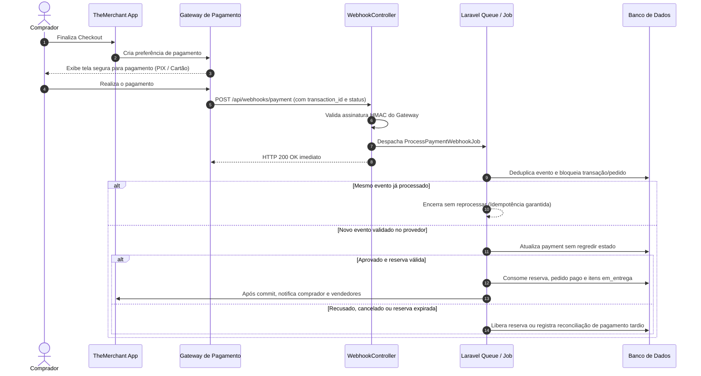
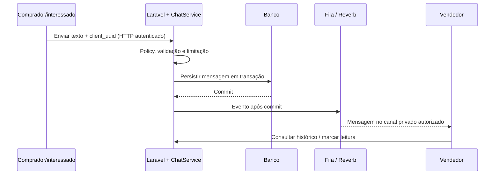

# 📐 Especificações Técnicas e Arquiteturais — TheMerchant

> **Documento de Arquitetura de Software e Especificação Técnica**  
> **Projeto:** TheMerchant (Marketplace de Cosméticos e Serviços para Jogos Digitais)  
> **Stack:** PHP 8.2+, Laravel 11/12, Blade, Tailwind CSS, Alpine.js, PostgreSQL / MySQL  

---

## 1. Visão Arquitetural

O **TheMerchant** segue o padrão de **Monólito Modular em Camadas**, tirando proveito da robustez do ecossistema Laravel. Esta abordagem mantém o front-end (Blade + Tailwind CSS + Alpine.js) e o back-end no mesmo repositório, simplificando o deploy, testes e manutenção, enquanto isola as regras de negócio em uma **Camada de Serviços (*Service Layer*)**, permitindo que futuras interfaces (como um App Mobile via API REST ou SPA em Inertia/Vue) reutilizem a mesma inteligência de domínio sem duplicação de código.

```
[ Navegador Web ]
       │  (HTTPS / CSRF Token / Cookie de Sessão)
       ▼
[ Camada de Roteamento (routes/web.php) ]
       │
[ Middlewares (Authenticate, CheckRole, VerifyCsrfToken) ]
       │
[ Controllers (Http/Controllers) ] ──> [ Form Requests (Validação) ]
       │
       ▼
[ Camada de Serviços (app/Services) ] ──> [ Policies (app/Policies) ]
   ├── CheckoutService
   └── PaymentGatewayService
       │
       ├──────────────────────────────┬──────────────────────────────┐
       ▼                              ▼                              ▼
[ Eloquent Models & DB ]      [ Jobs & Queues ]             [ Gateway Externo ]
(PostgreSQL / MySQL)          (Webhooks / E-mails)          (Mercado Pago / Stripe)
```

---

## 2. Dicionário de Dados e Modelo Físico

### 2.1 Tabela `users`
Armazena credenciais e dados de perfil de todos os usuários da plataforma.

| Campo | Tipo | Nulo | Descrição |
| :--- | :--- | :---: | :--- |
| `id` | `BIGINT UNSIGNED AUTO_INCREMENT` | Não | Chave primária |
| `name` | `VARCHAR(120)` | Não | Nome completo de exibição |
| `email` | `VARCHAR(150)` | Não | E-mail único para autenticação |
| `email_verified_at` | `TIMESTAMP` | Sim | Data da confirmação de e-mail |
| `password` | `VARCHAR(255)` | Não | Hash seguro da senha |
| `is_admin` | `BOOLEAN` | Não | Administração independente da habilitação de vendas (default: `false`) |
| `status` | `ENUM('active', 'suspended')` | Não | Estado da conta (default: `active`) |
| `remember_token` | `VARCHAR(100)` | Sim | Token para recurso "Lembrar-me" |
| `created_at` / `updated_at` | `TIMESTAMP` | Sim | Timestamps do Eloquent |

### 2.2 Tabela `seller_profiles`
Metadados de venda da mesma conta usada para comprar. Solicitações começam em `pending`; apenas um administrador pode aprovar ou suspender vendas. A suspensão comercial não suspende compras nem a entrega de pedidos existentes.

| Campo | Tipo | Nulo | Descrição |
| :--- | :--- | :---: | :--- |
| `id` | `BIGINT UNSIGNED AUTO_INCREMENT` | Não | Chave primária |
| `user_id` | `BIGINT UNSIGNED` | Não | FK para `users.id` (Unique, 1:1) |
| `status` | `ENUM('pending', 'approved', 'suspended')` | Não | Aprovação de vendas, default `pending` |
| `bio` | `TEXT` | Sim | Descrição comercial e apresentação |
| `reputation_score` | `DECIMAL(3,2)` | Não | Média agregada de avaliações (0.00 a 5.00) |
| `total_reviews` | `INT UNSIGNED` | Não | Total de avaliações recebidas (default: 0) |
| `total_sales` | `INT UNSIGNED` | Não | Total de itens vendidos com sucesso (default: 0) |
| `created_at` / `updated_at` | `TIMESTAMP` | Sim | Timestamps do Eloquent |

### 2.3 Tabela `games`
Catálogo oficial dos jogos suportados pela plataforma.

| Campo | Tipo | Nulo | Descrição |
| :--- | :--- | :---: | :--- |
| `id` | `BIGINT UNSIGNED AUTO_INCREMENT` | Não | Chave primária |
| `name` | `VARCHAR(100)` | Não | Nome do jogo (ex: Counter-Strike 2, Valorant) |
| `slug` | `VARCHAR(120)` | Não | Slug único para URLs amigáveis |
| `cover_image` | `VARCHAR(255)` | Sim | Caminho no storage da imagem de capa |
| `active` | `BOOLEAN` | Não | Se o jogo aceita novos anúncios (default: `true`) |
| `created_at` / `updated_at` | `TIMESTAMP` | Sim | Timestamps do Eloquent |

### 2.4 Tabela `categories`
Categorização hierárquica vinculada ou não a jogos específicos.

| Campo | Tipo | Nulo | Descrição |
| :--- | :--- | :---: | :--- |
| `id` | `BIGINT UNSIGNED AUTO_INCREMENT` | Não | Chave primária |
| `game_id` | `BIGINT UNSIGNED` | Sim | FK opcional para `games.id` |
| `name` | `VARCHAR(100)` | Não | Nome da categoria (ex: Facas, Skins de Armas, Coaching) |
| `slug` | `VARCHAR(120)` | Não | Slug único para busca |
| `type` | `ENUM('cosmetic', 'service')` | Não | Natureza do item comercializado |
| `created_at` / `updated_at` | `TIMESTAMP` | Sim | Timestamps do Eloquent |

### 2.5 Tabela `listings`
Armazena as publicações de cosméticos e serviços feitas pelos vendedores.

| Campo | Tipo | Nulo | Descrição |
| :--- | :--- | :---: | :--- |
| `id` | `BIGINT UNSIGNED AUTO_INCREMENT` | Não | Chave primária |
| `seller_id` | `BIGINT UNSIGNED` | Não | FK para `users.id` (o vendedor anunciante) |
| `game_id` | `BIGINT UNSIGNED` | Não | FK para `games.id` |
| `category_id` | `BIGINT UNSIGNED` | Não | FK para `categories.id` |
| `title` | `VARCHAR(150)` | Não | Título atrativo do anúncio |
| `slug` | `VARCHAR(180)` | Não | Slug único com hash para URL do produto |
| `description` | `TEXT` | Não | Detalhes, especificações e condições de entrega |
| `price` | `DECIMAL(10,2)` | Não | Valor em reais (mínimo R$ 1,00) |
| `status` | `ENUM('rascunho', 'publicado', 'pausado', 'vendido', 'bloqueado')` | Não | Estado atual do anúncio |
| `views_count` | `INT UNSIGNED` | Não | Contador de visualizações (default: 0) |
| `created_at` / `updated_at` | `TIMESTAMP` | Sim | Timestamps do Eloquent |

### 2.6 Tabela `listing_images`
Galeria de imagens anexadas ao anúncio.

| Campo | Tipo | Nulo | Descrição |
| :--- | :--- | :---: | :--- |
| `id` | `BIGINT UNSIGNED AUTO_INCREMENT` | Não | Chave primária |
| `listing_id` | `BIGINT UNSIGNED` | Não | FK para `listings.id` com `cascadeOnDelete` |
| `image_path` | `VARCHAR(255)` | Não | Caminho relativo no storage público |
| `is_primary` | `BOOLEAN` | Não | Se é a imagem de capa (default: `false`) |
| `display_order` | `SMALLINT UNSIGNED`| Não | Ordem de exibição no carrossel |
| `created_at` / `updated_at` | `TIMESTAMP` | Sim | Timestamps do Eloquent |

### 2.7 Tabela `carts` e `cart_items`
Controle do carrinho persistido por usuário autenticado.

```sql
-- carts
id BIGINT UNSIGNED AUTO_INCREMENT PRIMARY KEY,
user_id BIGINT UNSIGNED NOT NULL UNIQUE (FK users.id),
created_at, updated_at TIMESTAMP

-- cart_items
id BIGINT UNSIGNED AUTO_INCREMENT PRIMARY KEY,
cart_id BIGINT UNSIGNED NOT NULL (FK carts.id, cascade),
listing_id BIGINT UNSIGNED NOT NULL (FK listings.id),
quantity INT UNSIGNED NOT NULL DEFAULT 1,
unit_price DECIMAL(10,2) NOT NULL,
created_at, updated_at TIMESTAMP
```

### 2.8 Tabela `orders` e `order_items`
Registro de pedidos com preços e condições comerciais preservados; estados de pagamento/entrega podem evoluir.

```sql
-- orders
id BIGINT UNSIGNED AUTO_INCREMENT PRIMARY KEY,
order_number VARCHAR(32) NOT NULL UNIQUE,
buyer_id BIGINT UNSIGNED NOT NULL (FK users.id),
total_amount DECIMAL(10,2) NOT NULL,
status ENUM('pendente', 'pago', 'em_andamento', 'concluido', 'cancelado') NOT NULL DEFAULT 'pendente',
notes TEXT NULL,
created_at, updated_at TIMESTAMP

-- order_items
id BIGINT UNSIGNED AUTO_INCREMENT PRIMARY KEY,
order_id BIGINT UNSIGNED NOT NULL (FK orders.id, cascade),
listing_id BIGINT UNSIGNED NOT NULL (FK listings.id),
seller_id BIGINT UNSIGNED NOT NULL (FK users.id),
unit_price DECIMAL(10,2) NOT NULL, -- Preço congelado no ato da compra
quantity INT UNSIGNED NOT NULL DEFAULT 1,
delivery_status ENUM('aguardando_pagamento', 'em_entrega', 'entregue') NOT NULL DEFAULT 'aguardando_pagamento',
delivered_at TIMESTAMP NULL,
created_at, updated_at TIMESTAMP
```

### 2.8.1 Disponibilidade e reservas — revisão planejada (#29, #13)

O dicionário acima descreve a base inicial. Acrescentar `capacity` para sessões disponíveis de serviço e `session_duration_minutes`, com restrições positivas; cosmético único possui capacidade 1. Snapshot de tipo, duração e instruções por item do pedido. Serviço admite múltiplas compras até consumir sua capacidade.

Modelar `listing_reservations`: `id`, `listing_id`, `order_item_id` único, `quantity`, `expires_at`, `status` (active/confirmed/released), timestamps. Reservas ativas reduzem disponibilidade e são adquiridas sob lock; aprovação reduz capacidade e confirma reserva uma única vez. Expiração libera apenas reserva ainda ativa. Suspensão/pausa não pode apagar reservas ou histórico.

### 2.9 Tabela `payments`
Registro de auditoria e status retornado pelo gateway de pagamento.

| Campo | Tipo | Nulo | Descrição |
| :--- | :--- | :---: | :--- |
| `id` | `BIGINT UNSIGNED AUTO_INCREMENT` | Não | Chave primária |
| `order_id` | `BIGINT UNSIGNED` | Não | FK para `orders.id` |
| `gateway` | `VARCHAR(50)` | Não | Nome do provedor (ex: `mercadopago`, `stripe`) |
| `transaction_id` | `VARCHAR(100)` | Não | ID externo da transação no provedor |
| `status` | `VARCHAR(50)` | Não | Status bruto do gateway (ex: `approved`, `pending`, `rejected`) |
| `amount` | `DECIMAL(10,2)` | Não | Valor processado |
| `idempotency_key` | `VARCHAR(128)` | Não | Chave de idempotência para evitar duplicidade |
| `payload` | `JSON` | Sim | Resposta bruta recebida no webhook |
| `created_at` / `updated_at` | `TIMESTAMP` | Sim | Timestamps do Eloquent |

### 2.10 Tabela `reviews`
Avaliações concedidas exclusivamente após pedido entregue.

| Campo | Tipo | Nulo | Descrição |
| :--- | :--- | :---: | :--- |
| `id` | `BIGINT UNSIGNED AUTO_INCREMENT` | Não | Chave primária |
| `order_id` | `BIGINT UNSIGNED` | Não | FK para `orders.id`; admite avaliações de itens diferentes do pedido |
| `order_item_id` | `BIGINT UNSIGNED` | Não | FK para `order_items.id`, UNIQUE (uma avaliação por item) |
| `buyer_id` | `BIGINT UNSIGNED` | Não | FK para `users.id` (autor da avaliação) |
| `seller_id` | `BIGINT UNSIGNED` | Não | FK para `users.id` (vendedor avaliado) |
| `rating` | `TINYINT UNSIGNED` | Não | Nota de 1 a 5 estrelas |
| `comment` | `TEXT` | Sim | Comentário sobre o atendimento e agilidade |
| `created_at` / `updated_at` | `TIMESTAMP` | Sim | Timestamps do Eloquent |

### 2.11 Tabela `reports`
Canal de denúncias para supervisão e moderação administrativa.

| Campo | Tipo | Nulo | Descrição |
| :--- | :--- | :---: | :--- |
| `id` | `BIGINT UNSIGNED AUTO_INCREMENT` | Não | Chave primária |
| `reporter_id` | `BIGINT UNSIGNED` | Não | FK para `users.id` (denunciante) |
| `listing_id` | `BIGINT UNSIGNED` | Sim | FK opcional para `listings.id` |
| `reason` | `VARCHAR(100)` | Não | Motivo (ex: Golpe, Item Inexistente, Violação de Termos) |
| `details` | `TEXT` | Não | Evidências e texto explicativo |
| `status` | `ENUM('aberta', 'em_analise', 'procedente', 'improcedente')` | Não | Estado da denúncia (default: `aberta`) |
| `moderator_id` | `BIGINT UNSIGNED` | Sim | FK para `users.id` (admin que julgou) |
| `resolution_notes` | `TEXT` | Sim | Parecer da moderação |
| `created_at` / `updated_at` | `TIMESTAMP` | Sim | Timestamps do Eloquent |

---

## 3. Camada de Serviços (*Service Layer*)

Para cumprir o requisito não funcional **RNF08** de organização em camadas e testabilidade, a lógica pesada não reside em Controllers, mas em classes de serviço:

### 3.1 `CheckoutService`
Responsável pelo fluxo transacional de criação do pedido a partir do carrinho:
1. Validar preço, elegibilidade e quantidade (cosmético único = 1; serviço = sessões/capacidade).
2. Em `DB::transaction()`, bloquear registros de disponibilidade, reservar com expiração e criar pedido `pendente`.
3. Congelar preço, quantidade, tipo, duração e condições em `order_items`; limpar carrinho.
4. Após commit, criar preferência no gateway com chave idempotente; persistir identificador e reconciliar falhas sem manter transação de banco aberta durante a chamada externa.
5. Aprovação confirmada pelo provedor consome reserva: cosmético fica `vendido`; serviço mantém anúncio disponível se houver capacidade.
6. Recusa/cancelamento/expiração liberam reserva idempotentemente; pagamento tardio exige reconciliação/estorno no provedor sem dupla venda.
7. Executar job agendado de expiração e testes de concorrência/retry. Definir TTL configurável alinhado à preferência do provedor.

### 3.2 `PaymentGatewayService`
Responsável por encapsular chamadas de API externas:
1. `createPaymentPreference(Order $order): array` — Monta os dados do pedido e gera a URL de checkout no gateway;
2. `handleWebhookNotification(array $payload, string $signature): bool` — Valida a assinatura de segurança da notificação;
3. `verifyTransaction(string $transactionId): PaymentResult` — Consulta a API do provedor em busca do status final da transação;
4. `recordPayment(Order $order, string $transactionId, string $status, array $rawPayload): Payment` — Registra a tentativa garantindo unicidade pela `idempotency_key`.

---

## 4. Fluxo do Webhook e Idempotência



---

## 5. Segurança, Validação e Políticas (RBAC)

1. **Proteção CSRF:** Habilitada por padrão em todas as rotas web (`VerifyCsrfToken`). A rota `/api/webhooks/payment` é isenta de CSRF, mas protegida por **verificação de assinatura HMAC** no cabeçalho.
2. **Hashing de Senhas:** Implementado via `Hash::make()` utilizando o driver padrão `bcrypt` com salt gerado automaticamente.
3. **Policies do Laravel:**
   - `ListingPolicy`: Impede que um vendedor modifique ou exclua anúncios pertencentes a outro usuário. Permite apenas ao dono ou a um `admin` a exclusão.
   - `OrderPolicy`: Garante que um comprador visualize apenas seus próprios pedidos, e que um vendedor visualize apenas os itens de pedidos destinados a ele.
   - `ReviewPolicy`: Garante que apenas o comprador do item pago e entregue possa avaliá-lo, uma vez por `order_item_id`, sem depender de itens de outros vendedores.

## 6. Chat privado em tempo real — RF21–RF23 (planejado)

Revisão solicitada em 18/09/2026, issues #30 (backend), #31 (UI) e #32 (QA). O PDF original excluía chat; a revisão passa a incluir texto privado, histórico e não lidas na v1. Não implica que o módulo já esteja implementado.

### Persistência e autorização

- `conversations`: id, buyer_id (usuário interessado), seller_id, listing_id, buyer_last_read_message_id e seller_last_read_message_id opcionais, timestamps. UNIQUE(buyer_id, seller_id, listing_id). Impedir participantes iguais.
- `messages`: id, conversation_id, sender_id, client_uuid, body (texto de 1–2000 caracteres), timestamps. UNIQUE(conversation_id, sender_id, client_uuid); índice (conversation_id, id).
- Remetente sempre derivado da sessão. Cursor de leitura deve pertencer à conversa e só avançar após exibição.
- `ConversationPolicy` protege leitura, envio e canal; somente participantes ativos. Administrador não obtém acesso ao conteúdo pelo papel. Histórico não expõe e-mail, credenciais ou dados de pagamento.
- Anúncio publicado permite iniciar conversa; compra existente permite retomada após venda. Não excluir conversas ao arquivar anúncio. Sem anexos, grupos ou áudio/vídeo.
- `ChatService` e Form Requests concentram criação, envio idempotente, leitura paginada e atualização de cursor, com transação quando alterar múltiplas tabelas.

### Transporte e interface

Usar Laravel Broadcasting + Reverb e Laravel Echo, em versões compatíveis com o Laravel adotado. [Documentação oficial de Broadcasting](https://laravel.com/docs/11.x/broadcasting) e [Reverb](https://laravel.com/docs/11.x/reverb).

Persistir mensagem e transmitir evento enfileirado após commit em canal privado autorizado. UI Blade/Tailwind/Alpine envia por HTTP autenticado com CSRF, recebe via Echo e reconcilia mensagens por ID/UUID. Reconexão consulta histórico incremental, recuperando mensagens perdidas. Limitação de envios, saída escapada, estados de erro/retry e contador de não lidas são obrigatórios.

### Operação e validação

Servidor WebSocket e worker de fila devem ter inicialização/reinício documentados; configurar origens permitidas e TLS em produção, sem versionar segredos. Testar acesso HTTP e assinatura de canais com terceiros/contas suspensas, eventos após commit, reconexão, paginação e retries concorrentes. E2E em duas sessões usa Reverb e worker reais.



## 7. Rastreabilidade e pendências do documento acadêmico

- #27 completa RF03; #28 trata exposição de diagnósticos antes de qualquer publicação.
- #7/#8 incluem reputação; #23 inclui restauração de anúncio pelo administrador.
- #29 define cosmético único, sessões/capacidade e conclusão por item. Avaliação única por `order_item_id` entregue/pago via ReviewService e Policy, sem aguardar outros vendedores.
- #33 atualiza PDF e diagramas: associações visíveis, catálogo público para visitante, chat para comprador/vendedor e ERD com novas entidades.
- #25 depende das entregas e evidências de testes de todas as milestones, inclusive #32. O PDF original permanece referência histórica até sua revisão.
